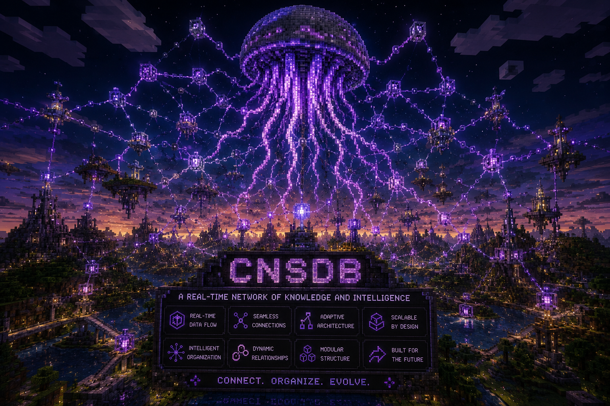

<p align="center">
  
</p>

<h1 align="center">🧠 cluaizd</h1>
<h3 align="center">The Living Database</h3>
<p align="center"><strong>The Universal, Autonomic, Shape-Shifting Database Engine</strong></p>

<p align="center">
  <a href="https://www.rust-lang.org/"></a>
  <a href="LICENSE"></a>
  <a href="http://www.lmdb.tech/doc/"></a>
  <a href="https://cluaiz.com"></a>
</p>

---

**cluaizd** is not just another database. It is a biologically-inspired, autonomic memory substrate built entirely in **Rust** over **LMDB**. Instead of forcing you to choose between Graph, Document, Vector, or Relational architectures, **cluaizd** provides an empty, lightning-fast "Brain" that can shape-shift into **10 different database paradigms** at runtime — using **WASM Genomes (DNA)**.

---

## ✨ Core Philosophy

- **Zero Hardcoding (The "Kabadi" Rule):** The core Rust engine is 100% logicless. It treats data as raw binary neurons. All data validation, schemas, indexing, and TTL logic are governed by dynamically loaded `.wasm` or `.json` DNA scripts attached to the neurons.
- **Run Anywhere (0ms Latency):** From massive cloud clusters down to embedded robotics and edge devices — via 0ms direct C-FFI memory-mapped bindings.
- **Autonomic Homeostasis:** The background "Dreamer" engine dynamically monitors physical RAM, CPU, and disk space to mathematically self-regulate memory tiers and garbage collection. It never crashes — it adapts.

---

## 🧬 Shape-Shifting: The 10-in-1 Database

By attaching different DNA scripts (`genomes/`), **cluaizd** instantly adopts the behavior of specialized databases — all within the same process, zero network hops:

| # | Mode | Replaces | Key Feature |
|---|---|---|---|
| 1 | ⚡ **Key-Value** | Redis | O(1) Fast-Path — bypasses WASM entirely |
| 2 | 🕸️ **Graph** | Neo4j | Index-free adjacency, variable-depth traversals |
| 3 | 📑 **Document** | MongoDB | Schema-less JSON, deep array filtering, projections |
| 4 | 🗄️ **Relational** | PostgreSQL | Hash-joins, strict schema enforcement, aggregations |
| 5 | 🧠 **Vector / AI** | Pinecone | Cosine/L2 similarity, Hybrid Search (vector + metadata) |
| 6 | ⏱️ **Time-Series** | InfluxDB | Time-window aggregations, automatic downsampling |
| 7 | 🌍 **Geo-Spatial** | PostGIS | Haversine radius search, polygon containment |
| 8 | 🏛️ **Wide-Column** | Cassandra | Append-only streams, ordered partition scans |
| 9 | 🔍 **Full-Text Search** | Elasticsearch | BM25 scoring, fuzzy typo-tolerant matching |
| 10 | 📦 **Blob / Object** | S3 / MinIO | ZSTD compression, byte-range streaming |

---

## ⚡ CNQL: Cluaiz Neural Query Language

**cluaizd** introduces **CNQL**, a universal pipeline-based query language capable of seamlessly blending all 10 paradigms into a single query — what used to require 4 separate API calls now runs in one pipeline:

```text
// Find active users → traverse their friend graph → filter by location → semantic search
find User(status: "active")
  -> traverse(edge: "friends", hops: 1..3)
  -> geo_near(lat: 28.6, lon: 77.2, radius: "5km")
  -> search(query: "Pizza", fuzzy: true)
  -> limit 20
```

The **cluaizd Planner** automatically determines the optimal execution path — triggering the O(1) LMDB Fast-Path for single-key lookups and WASM Sandbox execution for complex pipelines.

---

## 🏗️ 3-Tier Biological Storage (Bits-to-Atoms)

Data gracefully decays instead of crashing the system. The "Dreamer" background engine autonomically manages:

| Tier | Name | Storage | Latency | Contents |
|---|---|---|---|---|
| 1 | **Hot** | LMDB mmap (RAM) | `< 1ms` | Full payload + vectors + edges |
| 2 | **Warm** | LMDB (disk-backed) | `1-5ms` | Vectors + edges only (payload stripped) |
| 3 | **Cold** | ZSTD Level 9 (compressed) | `50ms+` | Everything compressed, rehydrated on demand |

---

## 🚀 Getting Started

### Prerequisites
- [Rust Toolchain](https://rustup.rs/) (1.75+)
- LLVM/Clang (for building LMDB C bindings)

### Run the Server
```bash
git clone https://github.com/cluaiz/cnsdb.git
cd cnsdb

cargo run -p cnsdb-server
# Server starts at http://localhost:7331
```

### Your First Neuron (No Schema Needed)
```bash
curl -X POST http://localhost:7331/neuron \
  -H "Content-Type: application/json" \
  -d '{
    "id": "user_aryan",
    "tier": "Hot",
    "raw_payload": [123, 34, 110, 97, 109, 101, 34, 58, 32, 34, 65, 114, 121, 97, 110, 34, 125],
    "vector_data": [],
    "adjacency": []
  }'
```

### Build the C-FFI Library (Robotics / BCI / Python)
```bash
cargo build --release -p cnsdb-ffi
# Windows: target/release/cnsdb.dll
# Linux:   target/release/libcnsdb.so
```
Include `ffi/cnsdb.h` in your C/C++ project for **0ms memory-mapped data ingestion** — no HTTP, no TCP.

---

## 🛡️ Architecture Highlights

- **Crash-Safe WAL:** Write-Ahead Log guarantees zero data loss on power failure. Every write is idempotently replayed on restart.
- **Sensory Sharding:** A dedicated, isolated `sensory_tissue.mdb` shard prevents high-frequency robotics/BCI streams (256,000+ writes/sec) from blocking the main cortical database.
- **CRISPR Surgery API:** Live, surgical parameter clamping and force-edge injection on individual neurons — without a server restart.
- **JUJU Canvas:** Real-time 3D spatial visualization of your entire database graph through the Genome Canvas GUI.
- **HEART WebSocket:** Database health mapped to biological biomarkers (BPM, SpO2, Metabolic Rate) — monitor your database like a living organism.

---

## 📚 Documentation

Full documentation lives in `docs/` and is indexed by `docs/registry.json`:

- 🌟 **[Why cluaizd?](docs/vision/why-cnsdb.md)** — Cost savings, paradigm comparison
- ⚡ **[Quickstart](docs/get-started/quickstart.md)** — Up and running in 60 seconds
- 🗺️ **[Rosetta Stone Cheatsheet](docs/cnql/rosetta-stone.md)** — Your DB's syntax → CNQL in 10 minutes
- 🧬 **[The 10 Genomes](docs/genomes/dna-architecture.md)** — How DNA shapes cluaizd
- 📡 **[Full API Reference](docs/clients/rest-api.md)** — All 13 endpoints documented
- 🤖 **[AI Agent Skill File](docs/get-started/skill.md)** — Cursor/Claude context for cluaizd development

---

## 📜 License & Usage

**cluaizd** is released under a **BSL 1.1 / Elastic License Hybrid**.
- The core engine is open and free for personal use, edge deployment, and scientific research.
- Providing **cluaizd** as a managed cloud service requires a commercial license.

---

<p align="center"><em>Built with ❤️ by <strong>Cluaiz</strong></em></p>