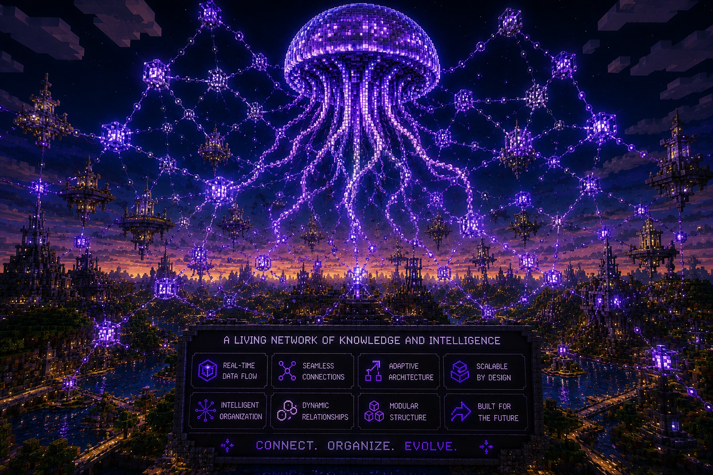
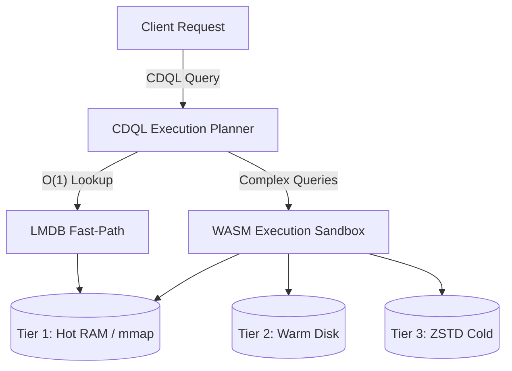

<p align="center">
  
</p>

<h1 align="center">
  <picture>
    <source srcset="https://fonts.gstatic.com/s/e/notoemoji/latest/1fabc/512.webp" type="image/webp">
    
  </picture> 
  Cluaizd
</h1>
<h3 align="center">Cluaiz Database</h3>
<p align="center"><strong>A High-Performance, Hardware-Native Multi-Model Database Engine</strong></p>

<p align="center"> 
  <a href="https://www.rust-lang.org/"></a>
  <a href="LICENSE"></a>
  <a href="http://www.lmdb.tech/doc/"></a>
  <a href="https://cluaiz.com"></a>
</p>

---

**Cluaizd** is a high-performance, hardware-native database engine built entirely in **Rust** over **LMDB**. Instead of forcing you to choose between Graph, Document, Vector, or Relational architectures, **Cluaizd** provides a core execution substrate that supports **10 different database paradigms** at runtime via **WASM Genomes (DNA)**.

---

## 🏛️ Architecture Overview

The core philosophy of Cluaizd is decoupling storage mechanics from data logic. The Rust engine operates as an ultra-fast, memory-mapped router, while dynamically loaded WebAssembly (WASM) modules enforce schemas and indexing.



## ✨ Core Philosophy

- **Zero-Logic Core Engine:** The core Rust engine acts purely as a memory-mapped router. It treats data as raw binary records. All data validation, schemas, indexing, and TTL logic are governed by dynamically loaded `.wasm` or `.json` DNA scripts attached to the records.
- **Hardware Agnostic & Low-Latency:** Designed to run locally on user hardware—from cloud clusters down to embedded robotics and edge devices—utilizing ultra-low latency direct C-FFI memory-mapped bindings.
- **Automated Resource Management:** A dedicated background thread dynamically monitors physical RAM, CPU, and disk space to mathematically self-regulate memory tiers and garbage collection.

---

## 🧬 Multi-Paradigm Support

By attaching different DNA scripts (`genomes/`), **cluaizd** natively supports the behavior of specialized databases within the same process:

| #   | Mode                    | Key Feature                                             |
| --- | ----------------------- | ------------------------------------------------------- |
| 1   | ⚡ **Key-Value**        | O(1) Fast-Path — bypasses WASM entirely                 |
| 2   | 🕸️ **Graph**            | Index-free adjacency, variable-depth traversals         |
| 3   | 📑 **Document**         | Schema-less JSON, deep array filtering, projections     |
| 4   | 🗄️ **Relational**       | Hash-joins, strict schema enforcement, aggregations     |
| 5   | 🧠 **Vector / AI**      | Cosine/L2 similarity, Hybrid Search (vector + metadata) |
| 6   | ⏱️ **Time-Series**      | Time-window aggregations, automatic downsampling        |
| 7   | 🌍 **Geo-Spatial**      | Haversine radius search, polygon containment            |
| 8   | 🏛️ **Wide-Column**      | Append-only streams, ordered partition scans            |
| 9   | 🔍 **Full-Text Search** | BM25 scoring, fuzzy typo-tolerant matching              |
| 10  | 📦 **Blob / Object**    | ZSTD compression, byte-range streaming                  |

---

## ⚡ CDQL: Cluaiz Database Query Language

**Cluaizd** utilizes **CDQL**, a pipeline-based query language capable of executing multiple data paradigms sequentially within a single query:

```text
// Example: Find active users → traverse their friend graph → filter by location → semantic search
find User(status: "active")
  -> traverse(edge: "friends", hops: 1..3)
  -> geo_near(lat: 28.6, lon: 77.2, radius: "5km")
  -> search(query: "Pizza", fuzzy: true)
  -> limit 20
```

The **CDQL Planner** automatically determines the optimal execution path — triggering the O(1) LMDB Fast-Path for single-key lookups and WASM Sandbox execution for complex pipelines.

---

## 🏗️ 3-Tier Storage Architecture

The background garbage collector automatically manages the data lifecycle across storage tiers based on system memory pressure:

| Tier | Name     | Storage                   | Latency | Contents                                    |
| ---- | -------- | ------------------------- | ------- | ------------------------------------------- |
| 1    | **Hot**  | LMDB mmap (RAM)           | `< 1ms` | Full payload + vectors + edges              |
| 2    | **Warm** | LMDB (disk-backed)        | `1-5ms` | Vectors + edges only (payload stripped)     |
| 3    | **Cold** | ZSTD Level 9 (compressed) | `50ms+` | Everything compressed, rehydrated on demand |

---

## 🌍 Industry Use Cases

Cluaizd is engineered for scenarios demanding absolute performance and extreme flexibility:

- **Edge Robotics & IoT:** The 0ms direct C-FFI bindings allow robotics controllers to ingest sensor telemetry directly into mapped memory without HTTP/TCP overhead.
- **AI Agentic Memory:** Seamlessly hybridizes Cosine Similarity vector searches with Graph traversals, enabling AI agents to query contextual relationships alongside semantic embeddings.
- **High-Frequency Trading (HFT):** Write-Ahead Logging (WAL) combined with memory-mapped execution guarantees microsecond-level tick-data retrieval without sacrificing crash safety.

---

## 🚀 Getting Started

### Prerequisites

- [Rust Toolchain](https://rustup.rs/) (1.75+)
- LLVM/Clang (for building LMDB C bindings)

### Run the Server

```bash
git clone https://github.com/cluaiz/cluaizd.git
cd cluaizd

cargo run --release -p cluaizd-server
# Server starts at http://localhost:7331
```

### Build the C-FFI Library (Robotics / Python / C++)

For zero-latency local deployments, build the native shared library:

```bash
cargo build --release -p cluaizd-ffi
# Windows: target/release/cluaizd.dll
# Linux:   target/release/libcluaizd.so
```

Include `ffi/cluaizd.h` in your C/C++ project for **0ms memory-mapped data ingestion**.

---

## 🛡️ Architecture Highlights

- **Crash-Safe WAL:** Write-Ahead Log guarantees zero data loss on power failure. Every write is idempotently replayed on restart.
- **Isolated High-Frequency Sharding:** A dedicated, isolated `sensory_tissue.mdb` shard prevents high-frequency data streams (256,000+ writes/sec) from blocking the primary database.
- **Live Mutation API:** Surgical parameter clamping and force-edge injection on individual records — without a server restart.
- **Spatial Visualization Canvas:** Real-time 3D spatial visualization of your entire database graph.
- **Health Metrics WebSocket:** Monitor database health through dedicated real-time diagnostic telemetry.

---

## 📚 Documentation

Full documentation lives in `docs/` and is indexed by `docs/registry.json`:

### Core Concepts
- 🌟 **[Why cluaizd?](docs/vision/why-cluaizd.md)** — Cost savings, paradigm comparison
- ⚡ **[Quickstart](docs/get-started/quickstart.md)** — Up and running in 60 seconds
- 🗺️ **[Rosetta Stone Cheatsheet](docs/cdql/rosetta-stone.md)** — Your DB's syntax → CDQL in 10 minutes
- 🧬 **[The 10 Genomes](docs/genomes/dna-architecture.md)** — How WASM Genomes structure cluaizd

### Deep Architecture
- 🧠 **[Dreamer Engine](docs/architecture/dreamer-engine.md)** — Background compaction & asynchronous analytics
- ⚡ **[FFI Bypass](docs/architecture/ffi-bypass.md)** — Achieving 0ms latency with C-FFI
- 🗄️ **[LMDB Zero-Copy](docs/architecture/lmdb-zero-copy.md)** — The foundational storage layer mechanics
- 🛡️ **[Sensory Shards](docs/architecture/sensory-shards.md)** — Handling 256k+ writes/sec cleanly

### Reference
- 📖 **[Comprehensive Reference Manual](docs/reference/index.md)** — Detailed specifications for CDQL, DNA, API, and Config
- 📡 **[Full API Reference](docs/clients/rest-api.md)** — All 13 endpoints documented
- 🤖 **[AI Agent Skill File](docs/get-started/skill.md)** — Cursor/Claude context for cluaizd development

---

## 📜 License & Usage

**cluaizd** is released under a **BSL 1.1 / Elastic License Hybrid**.

- The core engine is open and free for personal use, edge deployment, and scientific research.
- Providing **cluaizd** as a managed cloud service requires a commercial license.

---

<p align="center"><em>Built with ❤️ by <a href="https://cluaiz.com"><strong>Cluaiz Technologies</strong></a></em></p>
