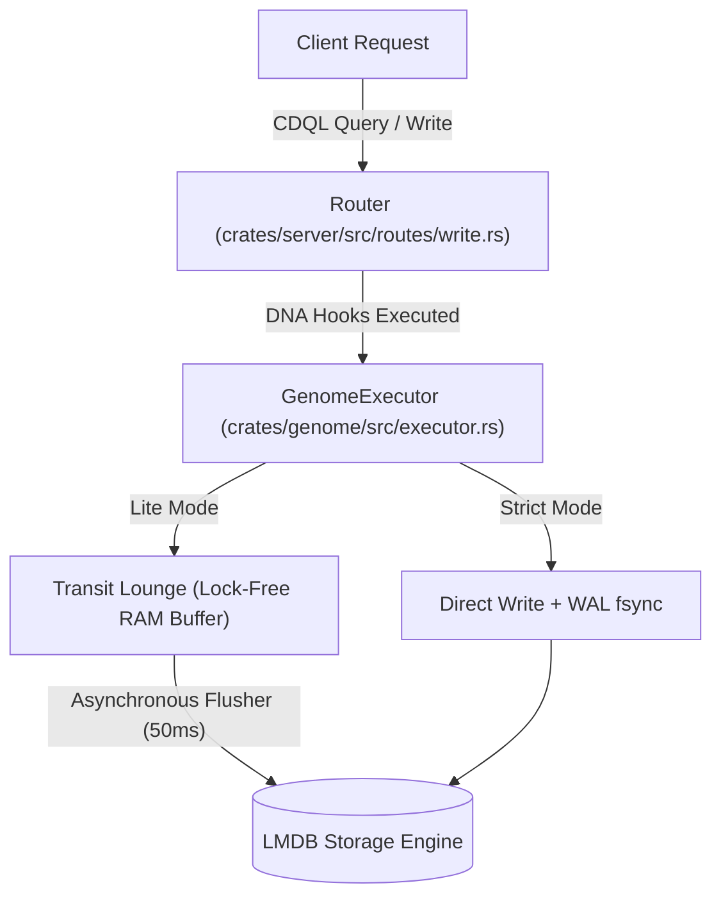

<p align="center">
  
</p>

<h1 align="center">
  <picture>
    <source srcset="https://fonts.gstatic.com/s/e/notoemoji/latest/1fabc/512.webp" type="image/webp">
    
  </picture> 
  Cluaizd
</h1>
<h3 align="center">Cluaiz Database</h3>
<p align="center"><strong>A High-Performance, Hardware-Native Multi-Model Database Engine</strong></p>

<p align="center"> 
  <a href="https://www.rust-lang.org/"></a>
  <a href="LICENSE"></a>
  <a href="http://www.lmdb.tech/doc/"></a>
  <a href="https://cluaiz.com"></a>
</p>

---

**Cluaizd** is a high-performance, hardware-native database engine built in **Rust** directly over **LMDB**. Instead of forcing you to choose between Graph, Document, Vector, or Relational architectures, Cluaizd provides a zero-logic execution substrate that supports **30 different database paradigms** at runtime via **Dynamic DNA (WASM, Rhai, CDQL, and JSON rules)**.

---

## 🏛️ Deep Architectural Mechanics

### 1. Zero-Logic Core & The Memory-Mapped Router
The core Rust engine of Cluaizd is intentionally policy-free. It views records simply as unified `UniversalNeuron` blocks containing:
- A raw, immutable/mutable byte payload (`Bytes`).
- A 16-dimensional hardware footprint vector (`[f32; 16]`).
- Adjacency vectors representing weighted graph edges (`NeuronEdge`).
- Dynamic DNA rulesets defining validation and lifecycle behaviors (`NeuronDna`).

Data logic, indexing configurations, and schema rules are completely isolated from the database engine and executed dynamically at the storage boundary.



---

### 2. High-Frequency Sensory Tissue Sharding
To handle massive telemetry throughput (256,000+ writes/second) without degrading database read latencies, Cluaizd implements physical sharding:
- **Sensory Shards (`sensory_tissue.mdb`)**: Isolated, high-frequency, append-only structures designed to ingest fast temporal/sensor streams.
- **Cognitive Tissue Shards (`cognitive_tissue.mdb`)**: The main database environment for traversing rich graphs, executing vector similarity lookups, and evaluating document indexes.

---

### 3. Dynamic DNA Hook Engine
The `GenomeExecutor` exposes three core transactional hooks to execute logic directly before and during disk mutations:

*   **`on_write` (Validation & Durability Hook)**:
    *   Fires before any record commit.
    *   Determines if a write is allowed (`Allow`), deferred to the WAL only (`Defer`), or rejected (`Abort`).
    *   Controls physical durability via `sync_write: "strict"` (synchronous write + OS `fsync` call) vs `sync_write: "lite"` (flushed to the lock-free Transit Lounge, then written asynchronously every 50ms).
*   **`on_read` (Reinforcement Hook)**:
    *   Triggered on record retrieval.
    *   Mutates graph edge weights dynamically (e.g., reinforcing active paths by a percentage or decaying unused ones).
*   **`on_lifecycle` (Garbage Collection & Compaction Hook)**:
    *   Fires during the compactor/dreamer thread scan.
    *   Can trigger **Apoptosis** (self-destruction of the neuron), clear payloads to transition the neuron from `Hot` to `Warm` memory tiers, or apply custom edge decay.

---

### 4. Zero-Copy Serialization (FlatBuffers vs Protobuf)
When reading and validating incoming records, Cluaizd supports **Zero-Copy FlatBuffers** integration:
- **No Companion Objects (CO)**: Traditional parsers read serialized payloads and reconstruct a secondary representation (like a JSON object or a Protobuf struct) in the heap. FlatBuffers reads values directly from offsets in the raw binary buffer.
- **WASM Memory Pointer Passing**: The database passes the raw memory pointer of the payload directly into the WebAssembly sandbox. The WASM module performs zero-copy offset reads to validate constraints, eliminating memory copies and heap allocations.

---

## 🧬 Multi-Paradigm Support (30 Database Engine Models)

By attaching different DNA scripts, **cluaizd** natively supports the behavior of specialized databases within the same process. Detailed guides for all **30 paradigms** are located in the [docs/cluaizd-types/](docs/cluaizd-types/) directory:

| # | Paradigm | Link | # | Paradigm | Link |
|---|---|---|---|---|---|
| 1 | ⚡ Key-Value | [01-key-value.md](docs/cluaizd-types/01-key-value.md) | 16 | 🔗 Blockchain / Ledger | [16-blockchain-ledger.md](docs/cluaizd-types/16-blockchain-ledger.md) |
| 2 | 📑 Document NoSQL | [02-document-nosql.md](docs/cluaizd-types/02-document-nosql.md) | 17 | 📜 Immutable Ledger | [17-ledger-blockchain.md](docs/cluaizd-types/17-ledger-blockchain.md) |
| 3 | 🗄️ Relational OLTP | [03-relational-oltp.md](docs/cluaizd-types/03-relational-oltp.md) | 18 | 🔑 Content-Addressable | [18-content-addressable.md](docs/cluaizd-types/18-content-addressable.md) |
| 4 | 📊 Columnar OLAP | [04-columnar-olap.md](docs/cluaizd-types/04-columnar-olap.md) | 19 | 🏁 Grid / In-Memory | [19-grid-data.md](docs/cluaizd-types/19-grid-data.md) |
| 5 | 🧠 Vector Similarity | [05-vector-similarity.md](docs/cluaizd-types/05-vector-similarity.md) | 20 | 📦 Multivalued Tables | [20-multi-valued.md](docs/cluaizd-types/20-multi-valued.md) |
| 6 | 🕸️ Graph Property | [06-labeled-property-graph.md](docs/cluaizd-types/06-labeled-property-graph.md) | 21 | 📊 Probabilistic Sketches | [21-probabilistic.md](docs/cluaizd-types/21-probabilistic.md) |
| 7 | 🌐 RDF Triple Store | [07-rdf-triple-store.md](docs/cluaizd-types/07-rdf-triple-store.md) | 22 | 🤝 CRDT (State/Op-Based) | [22-crdt.md](docs/cluaizd-types/22-crdt.md) |
| 8 | ⏱️ Time-Series | [08-time-series.md](docs/cluaizd-types/08-time-series.md) | 23 | 🔄 Operational Transformation | [23-operational-transformation.md](docs/cluaizd-types/23-operational-transformation.md) |
| 9 | 🌍 Spatial / GIS | [09-spatial-gis.md](docs/cluaizd-types/09-spatial-gis.md) | 24 | 🔲 Array / Tensor | [24-array-tensor.md](docs/cluaizd-types/24-array-tensor.md) |
| 10| 📦 Blob / Object | [10-blob-object.md](docs/cluaizd-types/10-blob-object.md) | 25 | 🕸️ Semantic Web (RDF) | [25-semantic-web.md](docs/cluaizd-types/25-semantic-web.md) |
| 11| 🔍 Inverted Index | [11-inverted-index.md](docs/cluaizd-types/11-inverted-index.md) | 26 | 📈 Multi-Valued Attributes | [26-multivalued.md](docs/cluaizd-types/26-multivalued.md) |
| 12| 🌳 Hierarchical | [12-hierarchical.md](docs/cluaizd-types/12-hierarchical.md) | 27 | 🎲 HyperLogLog & Bloom | [27-probabilistic-sketches.md](docs/cluaizd-types/27-probabilistic-sketches.md) |
| 13| 🕸️ Network Model | [13-network-model.md](docs/cluaizd-types/13-network-model.md) | 28 | 👥 Collaborative CRDT | [28-crdt-collaborative.md](docs/cluaizd-types/28-crdt-collaborative.md) |
| 14| ⏱️ Event Store / Sourcing | [14-event-store.md](docs/cluaizd-types/14-event-store.md) | 29 | 🧊 Analytical OLAP Cube | [29-analytical-cube.md](docs/cluaizd-types/29-analytical-cube.md) |
| 15| 📡 Pub-Sub / Message Queue | [15-pub-sub.md](docs/cluaizd-types/15-pub-sub.md) | 30 | 🔌 Embedded In-Process | [30-embedded-in-process.md](docs/cluaizd-types/30-embedded-in-process.md) |

---

## ⚡ CDQL: Cluaiz Database Query Language

**Cluaizd** utilizes **CDQL**, a pipeline-based query language capable of executing multiple data paradigms sequentially within a single query:

```text
// Example: Find active users → traverse their friend graph → filter by location → semantic search
find User(status: "active")
  -> traverse(edge: "friends", hops: 1..3)
  -> geo_near(lat: 28.6, lon: 77.2, radius: "5km")
  -> search(query: "Pizza", fuzzy: true)
  -> limit 20
```

---

## 🏗️ 3-Tier Storage Architecture

The compactor daemon (Dreamer Engine) automatically transitions records through three memory states based on access frequency and global memory limits:

| Tier | Storage State | Storage Target | Typical Latency | Payload State |
| ---- | ------------- | -------------- | --------------- | ------------- |
| 1    | **Hot**       | LMDB `mmap` (RAM) | `< 1ms` | Uncompressed, ready for instant access |
| 2    | **Warm**      | LMDB (Disk-Backed) | `1-5ms` | Payloads are stripped, vectors and edges retained |
| 3    | **Cold**      | ZSTD compressed block | `50ms+` | Fully compressed, rehydrated on demand |

---

## 🚀 Getting Started

### Run the Server

```bash
git clone https://github.com/cluaiz/cluaizd.git
cd cluaizd

cargo run --release -p cluaizd-server
# Server starts at http://localhost:7331
```

### Build the C-FFI Library (Robotics / Python / C++)

For zero-latency local deployments, build the native shared library:

```bash
cargo build --release -p cluaizd-ffi
```

---

## 📚 Documentation Directory

Detailed implementation documents:

### Core Concepts & Guides
- 🌟 **[Why cluaizd?](docs/vision/why-cluaizd.md)** — Cost savings, paradigm comparison
- ⚡ **[Quickstart](docs/get-started/quickstart.md)** — Up and running in 60 seconds
- 🗺️ **[Rosetta Stone Cheatsheet](docs/cdql/rosetta-stone.md)** — Your DB's syntax → CDQL in 10 minutes
- 🧬 **[The 4 Engines](docs/genomes/dna-architecture.md)** — How WASM, Rhai, JSON, and CDQL DNA structure cluaizd
- 🗂️ **[30 Database Paradigms](docs/cluaizd-types/30-embedded-in-process.md)** — In-depth guide to all supported database engine types
- 📦 **[DNA Templates & Binary Serialization](docs/cluaizd-dna-templates/README.md)** — Executable rulesets and Zero-Copy serialization formats (FlatBuffers, Protobuf)

### Deep Architecture
- 🧠 **[Dreamer Engine](docs/architecture/dreamer-engine.md)** — Background compaction & asynchronous analytics
- ⚡ **[FFI Bypass](docs/architecture/ffi-bypass.md)** — Achieving 0ms latency with C-FFI
- 🗄️ **[LMDB Zero-Copy](docs/architecture/lmdb-zero-copy.md)** — The foundational storage layer mechanics
- 🛡️ **[Sensory Shards](docs/architecture/sensory-shards.md)** — Handling 256k+ writes/sec cleanly

---

## 📜 License & Usage

**cluaizd** is released under a **BSL 1.1 / Elastic License Hybrid**.

<p align="center"><em>Built with ❤️ by <a href="https://cluaiz.com"><strong>Cluaiz Technologies</strong></a></em></p>
