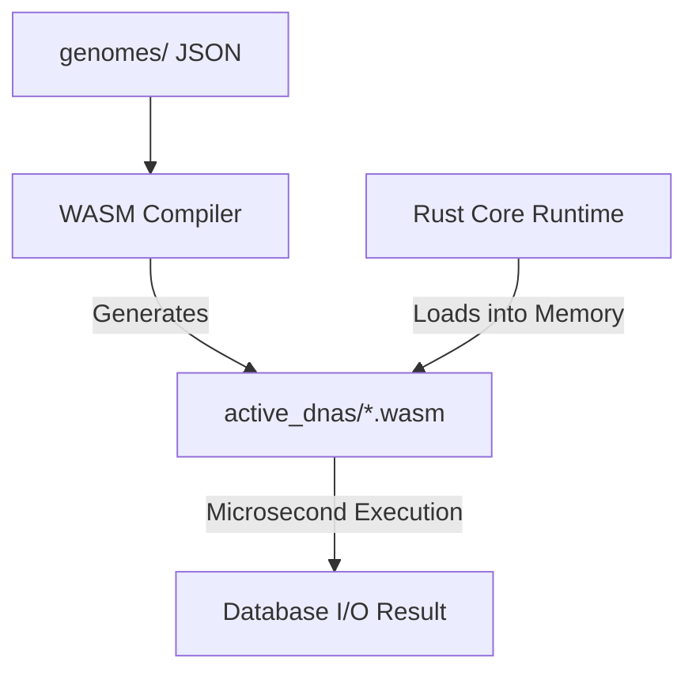

# ⚡ Active DNAs: Compiled WASM Executables

## Purpose
The `active_dnas/` directory acts as the highly optimized execution cache for Cluaizd. It holds the pre-compiled WebAssembly (WASM) binaries generated from the raw JSON scripts found in `genomes/` and `dnas/`.

## Architecture Flow

## 🧬 Significant Files (Deep Code-Level Breakdown)

### Compiled `.wasm` Binaries
This directory does not hold source code; it holds stripped, compiled WebAssembly binaries (e.g., `custom_graph_logic.wasm`, `strict_sql.wasm`).

**1. Sandboxed Execution**
- **Core Logic:** The Rust core uses the `wasmtime` or `wasmer` crate to instantiate these binaries inside an isolated execution environment (a Sandbox).
- **Execution Flow:** When a neuron is read from LMDB, the Rust engine copies the `UniversalNeuron` byte array into the linear memory of the WASM instance. It then calls the exported `on_read` or `on_write` WASM function. The WASM module executes its logic and returns an integer or enum back to Rust indicating success or failure.
- **Why?** Security and Stability. If a user uploads a malicious or infinite-looping DNA script, the WASM sandbox traps the error or times out, preventing the core Rust database process from crashing or leaking memory.

**2. Hot-Swapping**
- **Core Logic:** These binaries are dynamically linked at runtime.
- **Execution Flow:** If a user updates their DNA logic in the `dnas/` folder, the compiler drops the new `.wasm` file here. The Rust engine detects the file change and hot-swaps the WASM module pointer in memory without dropping a single database connection.
- **Why?** It enables Zero-Downtime schema and business logic migrations.
