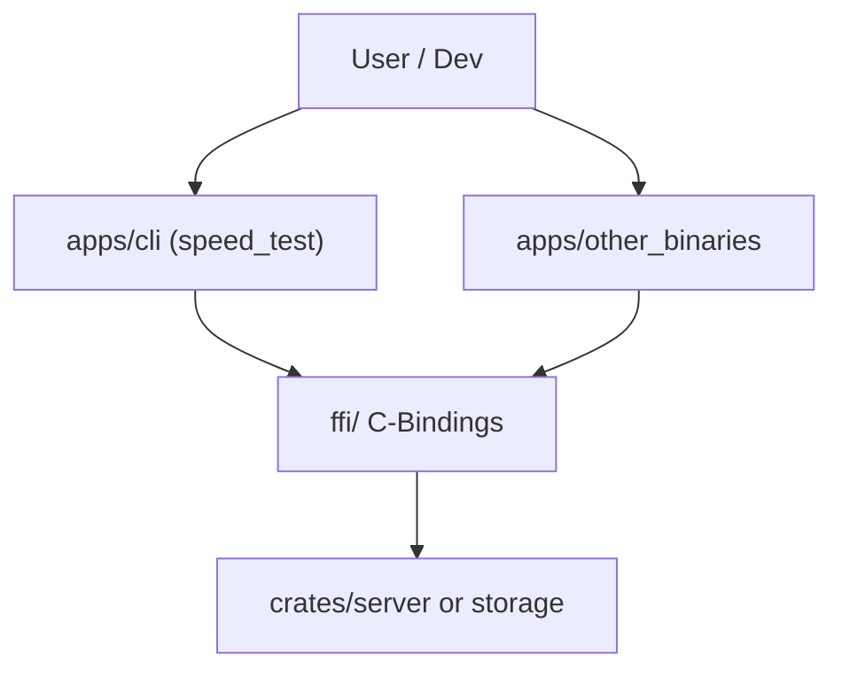

# 🚀 Apps: The Cluaizd Interface Layer

## Purpose
The `apps/` directory contains all executable interfaces, binaries, and entry points that interact with the core Cluaizd ecosystem. This isolates user-facing application shells from the core database business logic and engine mechanics.

## Architecture Flow

## 🧬 Significant Files & Folders (Deep Code-Level Breakdown)

### `cli/` (Command Line Interface)
This directory isolates all interactive console tooling.

**1. Binary Crate Isolation (`src/main.rs`)**
- **Core Logic:** Every sub-folder in `apps/` is typically structured as a standalone Rust binary crate (containing a `src/main.rs`), rather than a library crate (`src/lib.rs`).
- **Execution Flow:** When you run `cargo build --bin cli`, the compiler links the CLI executable against the external HTTP endpoints or the FFI bindings. It does NOT statically compile the entire database engine into the CLI tool unless explicitly requested.
- **Why?** Separation of concerns. If the CLI panics due to a bad user argument, it only crashes the CLI process. The core database server (`crates/server/`) remains untouched and continues serving production traffic.

**2. Interface vs. Engine Layer**
- **Core Logic:** Files in `apps/` are strictly forbidden from directly importing low-level traits from `engine-lmdb` or `storage`. 
- **Execution Flow:** All communication must go through the public HTTP Axum server or the C-ABI FFI wrapper.
- **Why?** It proves that Cluaizd is a true database server, not just an embedded library. By forcing our own internal tools to use the public APIs, we ensure the APIs are robust, performant, and feature-complete for end-users.
