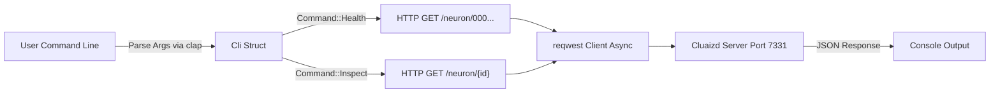

# 💻 CLI: Cluaizd Command Line Interface

## Purpose
The `apps/cli/` directory houses the primary administration and inspection tools for Cluaizd. Rather than interacting directly with the LMDB engine in-memory, this CLI acts as a pure HTTP client (via the `reqwest` crate) to interface with a running Cluaizd server safely.

## Architecture Flow

## 🧬 Significant Files (Deep Code-Level Breakdown)

### `src/main.rs`
This file implements a robust asynchronous CLI tool to interface with the running Cluaizd server using HTTP requests, rather than linking via FFI.

**1. CLI Argument Parsing (`clap` integration)**
- **Core Logic:** Uses `#[derive(Parser)]` and `#[derive(Subcommand)]` from the `clap` crate to define the command-line interface cleanly. It defines two main subcommands: `Health` and `Inspect { id: String }`.
- **Why?** `clap` provides a robust, type-safe way to parse user input, automatically generating `--help` menus and handling missing arguments gracefully without panicking.

**2. Asynchronous HTTP Execution (`tokio::main` & `reqwest`)**
- **Core Logic:** The `main` function is wrapped in `#[tokio::main]`, allowing it to run an asynchronous event loop. It initializes an asynchronous `reqwest::Client`.
- **Execution Flow:** 
  - For `Health`: It attempts a generic `GET` request to the zero UUID (`/neuron/00000000-0000-0000-0000-000000000000`). If the network request succeeds (regardless of whether the neuron exists, just checking if the server responds), it declares the server healthy.
  - For `Inspect`: It formats the URL with the provided neuron ID, awaits the HTTP response, and prints the raw JSON text if `resp.status().is_success()` is true.
- **Why?** Using async Rust (`tokio` + `reqwest`) ensures that the CLI doesn't block OS threads while waiting for network I/O. This is critical if the CLI is later expanded to perform thousands of concurrent benchmark queries against the server.

## Deep Explanation
Unlike `ffi/`, this CLI application acts as a completely separate external client. It does not load the LMDB engine into its own memory space. Instead, it relies strictly on the REST API exposed by `crates/server/`. This makes it the perfect administration tool to debug a live production server remotely without halting or locking the primary database process.
