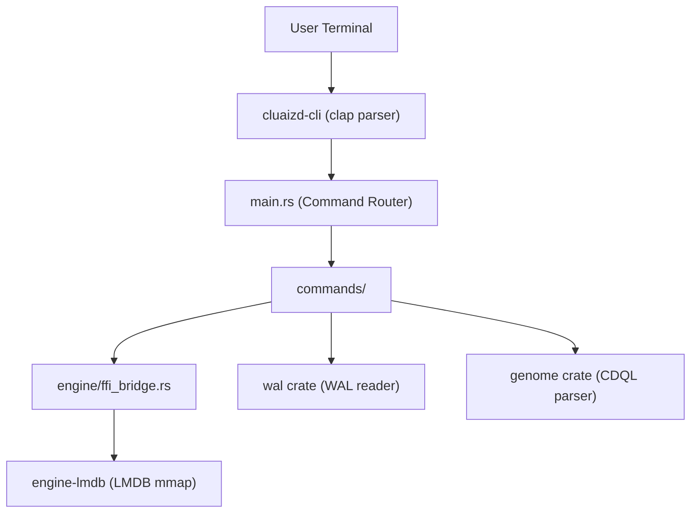

# `apps/cli` — Cluaizd Enterprise CLI

## Purpose

The `cli` crate is the **primary administrative interface** for Cluaizd. It provides direct, FFI-linked access to the storage engine without requiring the HTTP server to be running. This makes it suitable for:

- **Headless server administration** (Docker, SSH, CI/CD pipelines)
- **Database diagnostics** (shard stats, WAL inspection, tier breakdown)
- **Scripting and automation** via `--json` structured output mode

---

## Architectural Flow

---

## Module Structure

| Module | Purpose |
|---|---|
| `main.rs` | CLI entry point; parses args, sets global flags, routes to commands |
| `commands/config.rs` | Read/write `cluaizd.toml` via dot-notation |
| `commands/server.rs` | Start/stop/status/logs for the server daemon |
| `commands/health.rs` | FFI shard health check (neuron count) |
| `commands/inspect.rs` | FFI neuron lookup by UUID |
| `commands/db_ops.rs` | Shard backup, compact, and stats |
| `commands/wal_ops.rs` | WAL entry inspection and corruption detection |
| `commands/query.rs` | Direct CDQL execution via FFI (no HTTP) |
| `commands/dna.rs` | WASM DNA module deployment management |
| `engine/ffi_bridge.rs` | Safe wrapper around `engine-lmdb` FFI calls |
| `utils/printer.rs` | Structured output (supports `--json` and `--verbose` modes) |

---

## Global Flags

| Flag | Effect |
|---|---|
| `--json` | All output is structured JSON (`{"status":"ok","data":{...}}`) |
| `--verbose` / `-v` | Debug messages are printed (shard path, map size, etc.) |
| `--path <dir>` | Override shard directory (default: `./data/shards`) |

---

## Significant Files

### `engine/ffi_bridge.rs`
Opens a direct memory-mapped LMDB connection (`LmdbEnv::open`) using the same C bindings as the server. Executes all reads without allocating on the network stack. The `TierBreakdown` struct aggregates neuron counts by `StorageTier` (Hot/Warm/Cold) for the `db stats` command.

### `utils/printer.rs`
Uses two `AtomicBool` globals (`JSON_MODE`, `VERBOSE_MODE`) set once at startup from CLI flags. This avoids threading `bool` arguments through every function call. All output routes through `Printer::print_json()`, `print_success()`, `print_error()`, or `print_verbose()`.

### `commands/wal_ops.rs`
Calls `wal::recover_from_wal()` to iterate WAL entries. Reports `skipped_corrupt` count to surface data integrity issues before they become silent failures.
