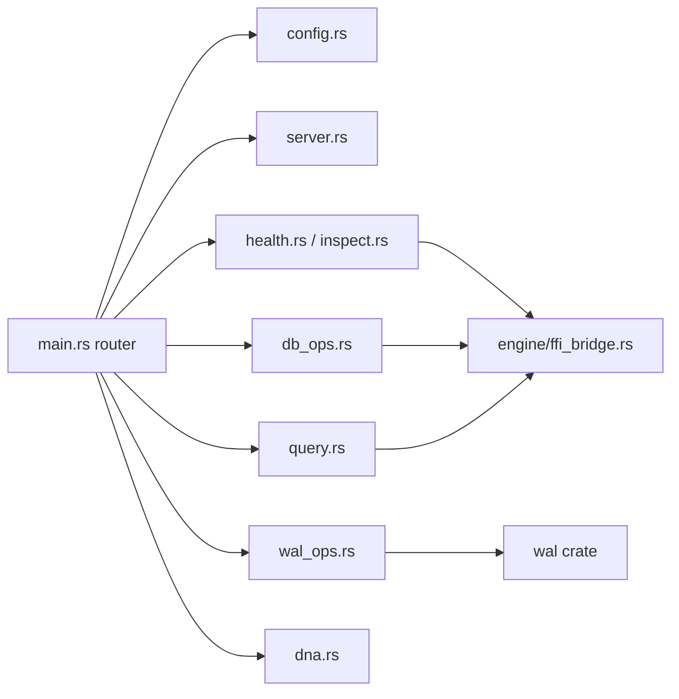

# `commands/` — CLI Command Modules

## Purpose

Each file in this directory handles exactly **one CLI command domain**. This strict separation ensures that adding a new command never requires modifying existing command logic.

## Execution Flow

## Significant Files

### `config.rs`
Reads `cluaizd.toml` as a raw `toml::Value` tree. The `get` command navigates the tree using dot-notation splitting (e.g. `server.port` → `value["server"]["port"]`). The `set` command serializes the updated tree back to TOML and atomically overwrites the file.

### `server.rs`
Writes the spawned process PID to `data/cluaizd.pid`. The `stop` command reads this file and sends `SIGTERM` (Unix) or `taskkill /F` (Windows). All `unsafe` blocks carry `// SAFETY:` annotations explaining invariant guarantees. The `logs` command reads `data/cluaizd.log` and shows the last N lines.

### `db_ops.rs`
Implements `backup` using `std::fs::copy` on the LMDB `data.mdb` file — safe on a live database because LMDB uses copy-on-write pages. `compact` runs backup to a new directory, allowing the user to replace the shard manually after the server is stopped. `stats` uses `FfiBridge::get_tier_breakdown()` to count neurons per storage tier.

### `wal_ops.rs`
Calls `wal::recover_from_wal()` in read-only inspection mode. Reports the `skipped_corrupt` counter to surface silent data integrity issues before they become unrecoverable failures.

### `query.rs`
Parses CDQL via `genome::cdql::parse()` then delegates to `FfiBridge::run_cdql()`. Only `Find`, `FindById`, and `Limit` ops are supported in FFI-direct mode. Complex ops (vector search, graph traversal) return a clear error directing the user to start the full server.
