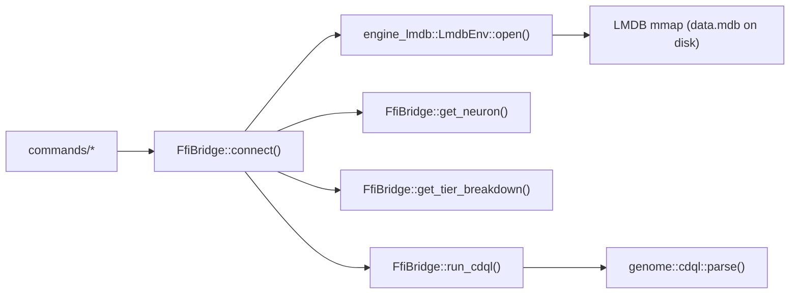

# `engine/` — FFI Storage Bridge

## Purpose

This module provides the **only safe, approved pathway** from CLI commands to the LMDB storage engine. No command module is allowed to call `engine-lmdb` functions directly — all storage access must go through `FfiBridge`.

This enforces a clean boundary: if the underlying LMDB API changes, only this file needs to be updated.

## Architectural Flow

## Significant Files

### `ffi_bridge.rs`
- **`FfiBridge::connect(path)`**: Opens `LmdbEnv` with a 1GB map size. Returns a `Result` — no panics.
- **`get_neuron(id)`**: Calls `read_neuron(&env, id, None)` — the `None` means no existing transaction context (new read transaction created internally by LMDB).
- **`get_shard_stats()`**: Calls `iter_all_neurons()` and returns the total count. Used by `db health`.
- **`get_tier_breakdown()`**: Iterates all neurons, groups by `StorageTier` (Hot/Warm/Cold). Used by `db stats`.
- **`run_cdql(cdql)`**: Parses CDQL via `genome::cdql::parse()`, then matches `CdqlOp::Find`, `FindById`, and `Limit`. Complex ops (vector, graph, geo) return a descriptive error directing the user to start the full server.

### `TierBreakdown` struct
A plain data struct with `hot: usize, warm: usize, cold: usize` counts. Returned by `get_tier_breakdown()` for consumption by `db_ops::stats()`.
