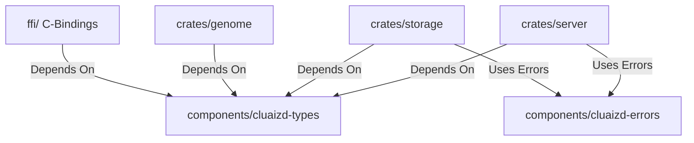

# 🧩 Cluaizd Components: The Modular Foundation

## 🎯 Deep Purpose
The `components/` directory exists to decouple base primitive types, common utilities, and generic error handling from the heavy operational logic found in `crates/`. 
By isolating these low-level dependencies into standalone Cargo components, we prevent circular dependencies across the workspace. If the HTTP server (`crates/server/`) needs to communicate with the LMDB Storage Engine (`crates/storage/`), they both share a common language by importing structs from `components/cluaizd-types/`.

## 🏛️ Architectural Flow

## 🧬 Significant Folders (Deep Breakdown)

**1. `cluaizd-types/`**
- **Core Logic:** Contains the absolute base structs like `UniversalNeuron` and `NeuronDna`. 
- **Execution Flow:** This crate compiles down to pure Rust data structures with `serde` Serialization/Deserialization bounds. It contains no stateful execution loops or I/O bounds.
- **Why?** By keeping this crate pure (no async runtime, no heavy I/O crates), any external Rust project can easily import `cluaizd-types` just to construct a valid Neuron before sending it over the network, without pulling in heavy dependencies like `tokio` or `lmdb`.

**2. `cluaizd-errors/`**
- **Core Logic:** A centralized `thiserror`-based enum repository for all possible failure states across the database.
- **Execution Flow:** Crates like `storage` return `Result<UniversalNeuron, StorageError>`.
- **Why?** It ensures consistent error logging and API responses. Using `anyhow` in library crates is an anti-pattern because it destroys structured error handling; `thiserror` forces developers to define exact failure states (like `NeuronNotFound(NeuronId)`), allowing calling code to implement targeted retry logic.
