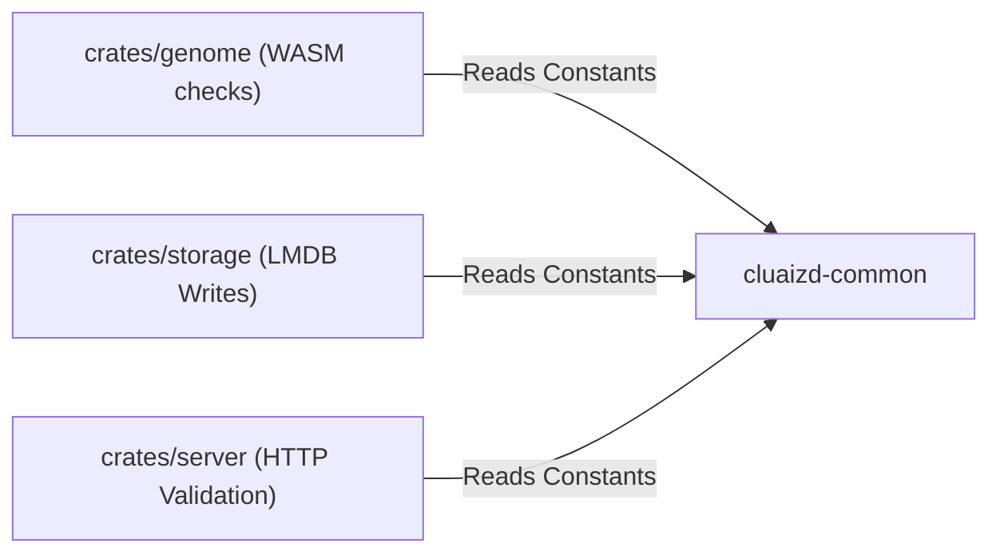

# 🛠️ cluaizd-common: Shared Utilities & Constants

## 🎯 Deep Purpose
The `cluaizd-common` crate acts as the repository for shared global constants and stateless utility functions used across the Cluaizd ecosystem. By placing these shared variables in a centralized, low-dependency crate, we avoid code duplication and ensure absolute consistency (e.g., maximum payload sizes or vector dimensions) across the FFI, Server, and Storage crates without inducing circular dependencies.

## 🏛️ Architectural Flow

## 🧬 Significant Files (Deep Code-Level Breakdown)

### `src/lib.rs`
This file contains pure, stateless utility functions and global constants.

**1. `validate_vector` Function**
- **Core Logic:** Iterates over the fixed 16-dimensional `[f32; 16]` array and checks `is_finite()` on every float.
- **Execution Flow:** Called immediately when data enters the system (either via FFI or HTTP). If an external AI model passes a vector containing `NaN` or `Infinity`, this function catches it and returns the index of the faulty dimension as an `Err(usize)`.
- **Why?** Passing `NaN` into LMDB's internal vector math logic (like Cosine Similarity) will corrupt the index math and cause silent query failures. Validating it at the very edge of the system ensures memory math safety.

**2. Hardcoded Architectural Limits**
- **Core Logic:** Defines constants like `MAX_ADJACENCY_EDGES = 512`, `VECTOR_DIMENSIONS = 16`, and `MAX_PAYLOAD_SIZE_BYTES = 1_073_741_824` (1 GB).
- **Execution Flow:** The CDQL planner uses these constants to size its internal iterator buffers. The Server uses `MAX_PAYLOAD_SIZE_BYTES` to reject HTTP bodies that exceed the limit.
- **Why?** Hardcoding these as `pub const` ensures they are compiled directly into the binary at build time. Using constants instead of runtime configuration files guarantees extreme performance, as bounds-checking against a `const` compiles down to a single zero-overhead CPU instruction.
