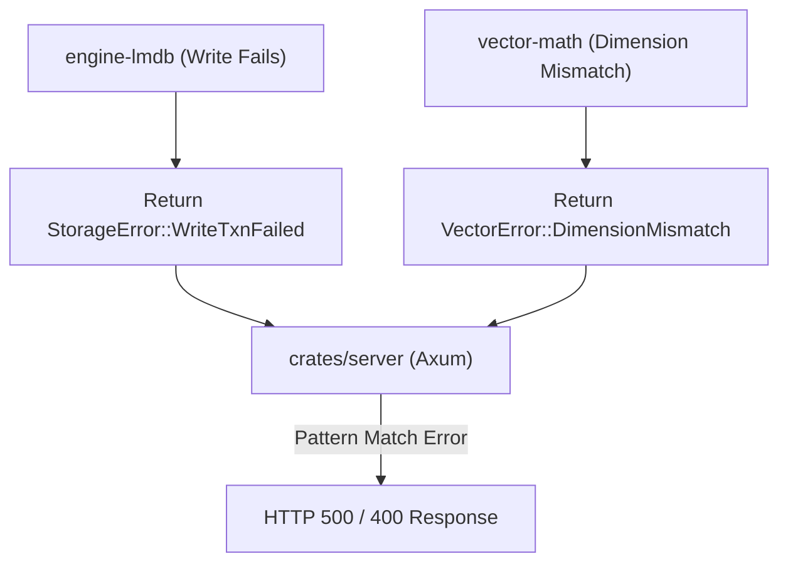

# 🚫 cluaizd-errors: Centralized Error Architecture

## 🎯 Deep Purpose
The `cluaizd-errors` crate provides strongly-typed, predictable error handling across the entire Cluaizd ecosystem. By centralizing errors, we prevent "stringly-typed" error messages and ensure that upstream APIs (like the Axum HTTP server) can map internal database failures directly to appropriate HTTP status codes (e.g., 404, 500, 400).

## 🏛️ Architectural Flow

## 🧬 Significant Files (Deep Code-Level Breakdown)

### `src/storage_error.rs`
This file explicitly defines every way the physical LMDB disk engine or WASM integration can fail.

**1. `StorageError` Enum (`thiserror` Integration)**
- **Core Logic:** Uses the `#[derive(Debug, thiserror::Error)]` macro to generate standard `std::error::Error` trait implementations automatically.
- **Execution Flow:** When a function in `crates/storage/` encounters an LMDB error (e.g., `lmdb::Error::MapFull`), it maps it into a structured variant like `StorageError::WriteTxnFailed(String)`.
- **Why?** `thiserror` allows us to define highly specific context. For example, `StorageError::NeuronNotFound(NeuronId)` takes a `NeuronId` as its payload. This allows the HTTP server to catch this exact variant and extract the ID to log: `"Neuron 550e8400... was requested but not found"`, and cleanly return an `HTTP 404 Not Found`, rather than a generic HTTP 500 crash.

**2. Why NOT `anyhow`?**
- **Core Logic:** Notice there is no `anyhow::Error` used here.
- **Why?** `anyhow` is fantastic for applications (`src/main.rs`), but toxic for libraries (`src/lib.rs`). If `engine-lmdb` returned `anyhow::Result`, the calling server would only get an opaque string. It couldn't programmatically tell if the error was a "Disk Full" (needs a retry) or a "Data Corruption" (needs an abort). By using strongly-typed enums, the Rust compiler forces developers to handle every possible failure state explicitly.
