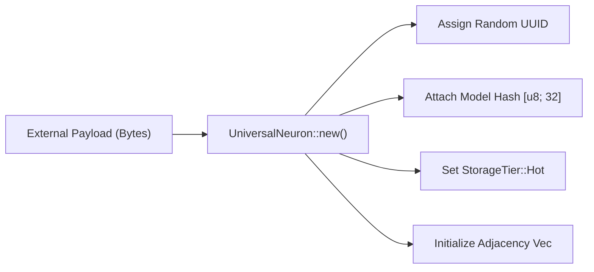

# 🧬 cluaizd-types: The Universal Neuron Architecture

## 🎯 Deep Purpose
The `cluaizd-types` crate defines the absolute atomic data structure of the entire database: the `UniversalNeuron`. This single crate dictates the schema of data both in RAM and on disk. There are no relational tables; there are only Neurons.

## 🏛️ Architectural Flow

## 🧬 Significant Files (Deep Code-Level Breakdown)

### `src/neuron.rs`
This file contains the most critical `struct` definitions in the entire repository.

**1. `UniversalNeuron` Struct**
- **Core Logic:** Defines fields: `id`, `raw_payload` (zero-copy `Bytes`), `vector_data` (16-dimensional `f32` array for hardware acceleration), `model_creator_hash`, `adjacency` (Graph edges), `tier`, and `dna` (`Option<NeuronDna>`).
- **Execution Flow:** The constructor `UniversalNeuron::new()` generates a UTC nanosecond timestamp and a fresh UUID. It specifically leaves the `dna` field as `None` (defaulting to static "Static Heap" mode) until explicitly hydrated by a Genome script.
- **Why?** We co-locate Vector embeddings, Graph Adjacency lists, and Document payloads into a single memory-contiguous struct. This ensures that reading a document automatically loads its vector and graph edges into the CPU cache in a single disk read, bypassing the need for SQL `JOIN` operations.

**2. `NeuronDna` Struct**
- **Core Logic:** Holds the strings for execution hooks: `on_write`, `on_read`, `on_index`, `on_traverse`, `on_dream`, `on_lifecycle`. 
- **Execution Flow:** These hooks are parsed at runtime by the `genome` crate to instantiate the WebAssembly sandboxes. The field `wasm_module` is marked `#[serde(skip)]` because compiling a WASM module takes CPU cycles and cannot be cleanly serialized to disk.
- **Why?** It acts as the interface bridging the static Rust data structures to the dynamic Rhai/WASM scripting engine.

**3. `StorageTier` Enum**
- **Core Logic:** Defines `Hot`, `Warm`, `Cold` states.
- **Why?** To support the Biological Garbage Collector. `Hot` keeps the payload in RAM, `Warm` deletes the payload but keeps the intuition vector and graph edges alive, `Cold` compresses everything using ZSTD.
