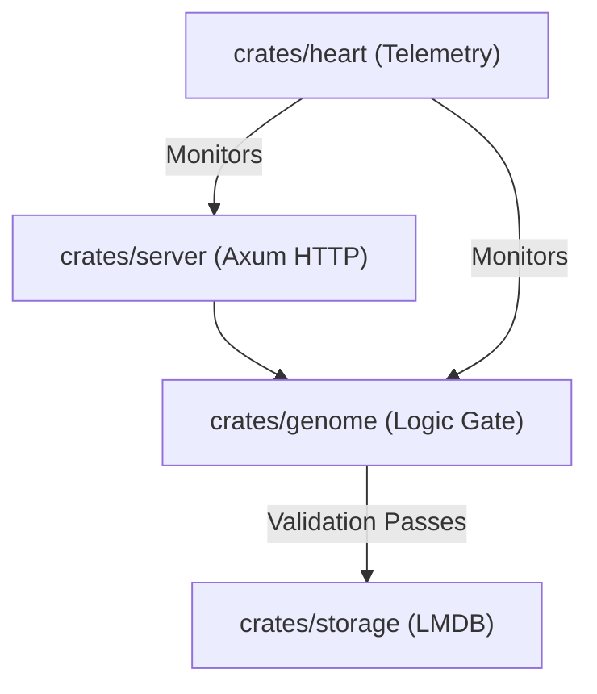

# 📦 crates: The Core Operational Engine

## 🎯 Deep Purpose
The `crates/` directory contains the heavy-lifting, stateful operation logic of the database. Unlike `components/`, which contains stateless data structures and enums, the crates here contain Tokio async runtimes, actual C-FFI memory mapping, and WebAssembly execution pipelines. This is where the database actually *runs*.

## 🏛️ Architectural Flow

## 🧬 Significant Folders (Deep Breakdown)

**1. `server/`**
- **Core Logic:** The HTTP/REST edge of the database.
- **Why?** By isolating network logic here, we can completely strip out `crates/server/` if we want to compile Cluaizd as a pure embedded library (using `ffi/`) without bringing in the heavy `axum` and `hyper` dependencies.

**2. `storage/`**
- **Core Logic:** The physical B+Tree LMDB mapper.
- **Why?** It abstracts all `unsafe` C code. No other crate in this workspace is allowed to execute `unsafe` LMDB calls.

**3. `genome/`**
- **Core Logic:** The WASM and Rhai scripting sandbox.
- **Why?** It ensures that data validation is decoupled from physical storage. You can hot-swap DNA rules without ever touching the `storage/` code.

**4. `heart/`**
- **Core Logic:** The Biological Telemetry tracker.
- **Why?** Provides self-awareness to the database, allowing it to monitor its own CPU and RAM usage to autonomously throttle requests during high load.
