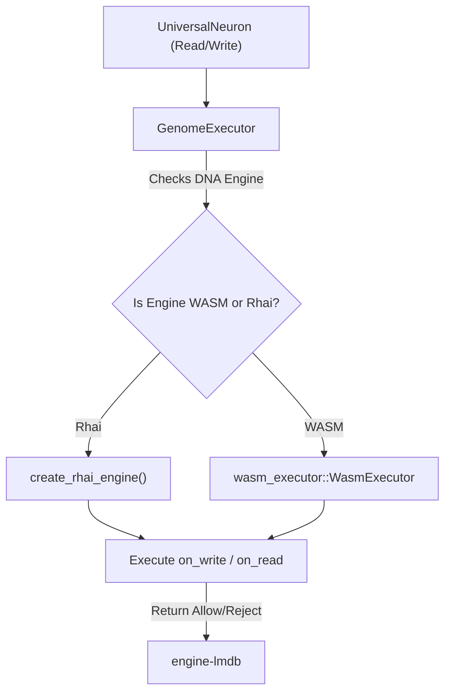

# 🧠 crates/genome: The DNA Execution Engine

## 🎯 Deep Purpose
The `genome` crate is the dynamic brain of Cluaizd. If `engine-lmdb` is the static physical brain tissue (disk), `genome` is the electrical impulses. It is responsible for parsing CDQL queries, compiling JSON/Rhai scripts into WASM, and executing sandboxed logic for every single database operation.

## 🏛️ Architectural Flow

## 🧬 Significant Files (Deep Code-Level Breakdown)

### `src/cdql/` (The Universal Query Engine)
This module acts as the universal translator between the user's intent and the 10 distinct database paradigms.

**1. `parser.rs`**
- **Core Logic:** Parses the raw CDQL string (e.g., `find User(name: "Aryan") -> join(target: "orders")`) into a structured `CdqlQuery` enum list.
- **Execution Flow:** It evaluates exactly which operators (`CdqlOp`) are being requested. It maps Graph commands (`traverse`), Vector commands (`similar_to`), and Relational commands (`join`) into the same universal pipeline.

**2. `planner.rs`**
- **Core Logic:** Transforms the `CdqlOp` ast into actionable execution `PlanStep`s.
- **Why?** The planner acts as the query optimizer. If a user runs `find * -> limit 10 -> sort()`, the planner reorganizes the execution so `limit` is applied optimally, preventing memory bloat before sorting.

### `src/executor.rs`
This file contains the core `GenomeExecutor` which acts as the gatekeeper for all data mutations.

**1. `execute_on_write`**
- **Core Logic:** Intercepts a neuron before it hits the disk. It checks if the neuron has a `NeuronDna` attached. If the DNA engine is `"rhai"`, it spins up a highly restricted `rhai::Engine`. 
- **Execution Flow:** It injects system telemetry (`bp` and `spo2`) into the Rhai scope, allowing the script to dynamically reject writes if the server is under too much load (e.g., `if bp > 90 { return Reject; }`). It parses the result map to extract `Durability` (Lite vs Strict sync) and the action (`Allow`, `Defer`, `Abort`).
- **Why?** This prevents malformed data from ever reaching LMDB. By allowing scripts to access telemetry, the database can autonomously shed load without external load balancers.

**2. `execute_on_lifecycle`**
- **Core Logic:** Evaluates age and tier transitions.
- **Execution Flow:** The background Garbage Collector (GC) passes the current time to this function. The Rhai script calculates `age_ns`. It can return `delete_neuron: true` (triggering Apoptosis) or trigger a tier shift (`new_tier: "Warm"`), which instructs the GC to strip the payload to save disk space.

### `src/wasm_executor.rs`
- **Core Logic:** Manages the `wasmtime` engine instances.
- **Why?** Rhai is fast, but interpreted. For absolute peak performance, Cluaizd compiles logic to WASM. This file handles the complex memory-sharing (linear memory mapping) required to pass a Rust `[u8]` byte array into a WASM sandbox securely.
