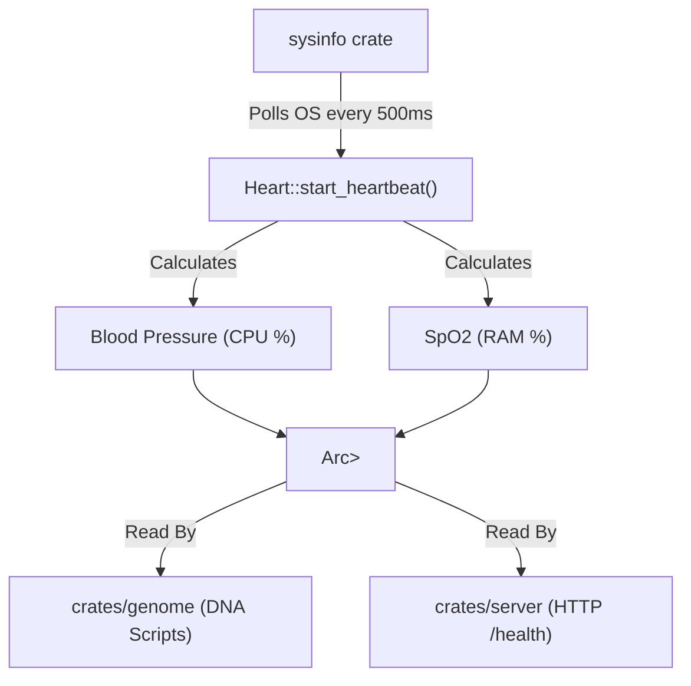

# ❤️ crates/heart: The Autonomic Telemetry Controller

## 🎯 Deep Purpose
The `heart` crate is an autonomic biological monitor for the database engine. Instead of relying on external tools like Datadog or Prometheus to monitor health, Cluaizd monitors its own physical host machine in real-time. It measures CPU load, RAM availability, and disk I/O, exposing this data directly to the DNA execution engine to enable self-throttling and self-healing.

## 🏛️ Architectural Flow

## 🧬 Significant Files (Deep Code-Level Breakdown)

### `src/lib.rs`
Contains the core `Telemetry` struct and the background polling loop.

**1. Biological Hardware Mapping**
- **Core Logic:** Maps standard computing metrics to biological terms.
  - `bp_systolic` (Blood Pressure) = Global CPU Load (0-100%).
  - `spo2` (Oxygen) = Global Available RAM (0-100%).
  - `process_bp` = CPU load specifically caused by the Cluaizd process.
- **Execution Flow:** The `start_heartbeat` function spawns a detached Tokio task. Inside a `loop`, it calls `sys.refresh_cpu_usage()` and `sys.refresh_memory()` every 500 milliseconds. It locks the `Arc<RwLock>` just long enough to update the struct, then sleeps.
- **Why?** Lock contention is a massive performance killer. By updating the lock only twice a second, worker threads checking the telemetry (e.g., during a CDQL query) almost never hit a blocked lock. This provides "eventually consistent" hardware metrics at near-zero CPU cost.

**2. DNA Integration**
- **Why?** A Rhai DNA script can check `if system_metrics.bp > 90`. If the CPU is pegged at 90%, the database can autonomously start rejecting non-critical `INSERT` operations (returning an HTTP 429 Too Many Requests) until the "Blood Pressure" drops, preventing a total catastrophic server crash.
