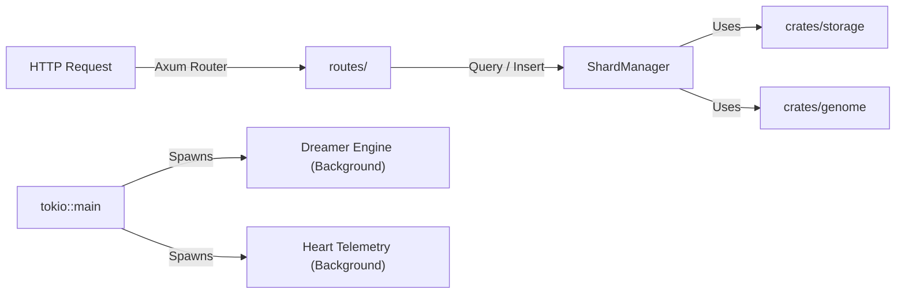

# 🌐 crates/server: The HTTP Nervous System

## 🎯 Deep Purpose
The `server` crate is the primary external interface for Cluaizd. It encapsulates the `Axum` HTTP web framework, managing all incoming REST/WebSocket traffic, connection pooling, background worker spawning, and crash recovery. It translates external network requests into internal Rust memory operations.

## 🏛️ Architectural Flow

## 🧬 Significant Files (Deep Code-Level Breakdown)

### `src/main.rs`
The absolute entry point of the Cluaizd server process.

**1. WAL Boot Recovery (Crash Safety)**
- **Core Logic:** Before binding to the TCP port, it opens the Write-Ahead Log (`data/wal`).
- **Execution Flow:** It iterates through uncommitted WAL entries. If the server crashed during a power outage, it extracts the JSON payloads from the WAL and idempotently replays them into `engine-lmdb`.
- **Why?** Because LMDB's `Durability::Lite` defers OS page flushing to maximize speed, a hard crash could lose the last few milliseconds of data. The WAL guarantees zero data loss (ACID Durability) while maintaining LMDB's extreme speed.

**2. Asynchronous Bootstrapping**
- **Core Logic:** Uses `#[tokio::main]` to establish the async reactor.
- **Execution Flow:** It instantiates the `Heart` telemetry tracker, the `SensoryShard` (a high-speed ring buffer for transient data), and loads all `genomes/` into RAM. Crucially, it spawns the background `wasm_executor::start_dna_watcher` which watches the `active_dnas/` folder for hot-swaps.
- **Why?** By pushing file-watching, telemetry, and background "Dreaming" (semantic graph linking) into separate Tokio asynchronous tasks, the main thread remains 100% unblocked to serve incoming HTTP requests at microsecond latencies.
