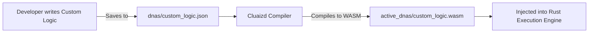

# 🧪 DNAs: User-Defined Logic Extensions

## Purpose
The `dnas/` directory is the staging area for **User-Created Custom DNA Scripts**. While the `genomes/` directory contains the 30 base templates built into Cluaizd, this folder allows developers to define their own custom data validation, business logic, and complex triggers before they are compiled into the database.

## Architecture Flow

## 🧬 Significant Files (Deep Code-Level Breakdown)

### User-Defined `*.json` or `*.rhai` Scripts
This folder acts as the drop-zone for custom logic authored by the end-user (Database Administrators or App Developers). 

**1. Custom Schema Enforcement**
- **Core Logic:** Users write scripts that intercept database operations specifically targeted at their application's data. 
- **Execution Flow:** A user might drop a file named `banking_ledger.json` here. It contains Rhai code: `if payload.amount < 0 && payload.transaction_type == "deposit" { return Reject; }`. The Cluaizd background compiler detects this file, validates the syntax, and compiles it into a WASM binary placed in `active_dnas/`.
- **Why?** It replaces the need for mid-tier application servers. Instead of the backend Node.js or Python server validating transactions before sending them to the database, the database validates them intrinsically at the C/Rust memory level.

**2. The Compiler Pipeline**
- **Core Logic:** The files here are purely intermediate source code.
- **Execution Flow:** They are not executed directly. They are read by `crates/genome/src/compiler.rs` (or equivalent build tools), transpiled if necessary, and passed to the Rust-to-WASM toolchain. 
- **Why?** Maintaining a separation between raw source (`dnas/`) and executables (`active_dnas/`) ensures that syntax errors in a user's new script do not instantly break the live database. Only successfully compiled scripts make it to the active directory.
