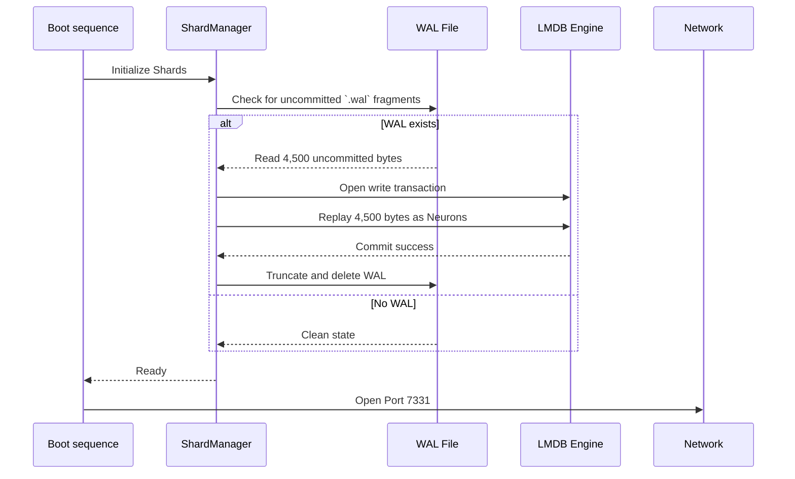

# 🛡️ WAL Internals & Crash Recovery

CLUAIZD uses a **Write-Ahead Log (WAL)** designed for zero-data-loss durability while maintaining millions of inserts per second via the `Transit Lounge` ring buffer.

## The Problem with LMDB and Rust
LMDB is an incredible B+Tree memory-mapped store, but writing to it requires a write transaction. If you open a write transaction for every single API request, you will bottleneck at ~10,000 req/sec due to disk fsyncs.

CLUAIZD achieves >1,000,000 req/sec by decoupling the API from LMDB using the **WAL**.

## The Architecture

1. **Ingestion (The Transit Lounge)**
   - API request hits `/neuron`.
   - The payload is instantly pushed to the `crossbeam::queue::ArrayQueue` (Lock-Free RAM Buffer).
   - HTTP 201 is returned to the client in `<100 microseconds`.

2. **The WAL Writer Daemon**
   - A background Tokio task (`wal_writer.rs`) polls the Transit Lounge continuously.
   - It pulls batches of neurons (e.g., 10,000 at a time).
   - It appends them to an append-only `.wal` file on disk.
   - It executes `fsync` (forcing OS to flush to physical disk).
   - *Only now* is the data considered safe.

3. **The LMDB Committer**
   - A separate background task reads from the `.wal` file.
   - It opens a single LMDB Write Transaction.
   - It inserts all 10,000 neurons into the B+Tree.
   - It commits the transaction and truncates the WAL file.

---

## The Recovery Sequence

If the power is pulled from the server, RAM is wiped. 

When CLUAIZD starts up, before opening port `7331`, it executes the **Crash Recovery Sequence**:

### Why it works
Because the WAL is an append-only sequential write, modern NVMe SSDs can write to it at gigabytes per second. It requires no tree-rebalancing or complex indexing, making it perfectly suited to absorb massive write spikes (like IoT ingestion via `/ingest/stream`) without dropping data.
