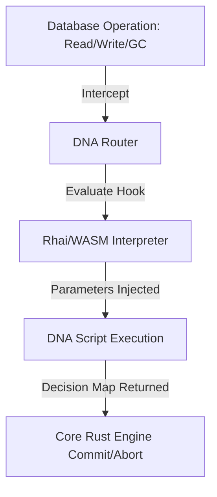

# 🧬 Cluaizd DNA Templates Guide

This directory contains reusable templates and guides for writing Cluaizd DNA scripts in Rhai, WASM, and other supported formats.

---

## 💡 What is Cluaizd DNA?

In Cluaizd, **DNA (Dynamic Neural Affordance)** represents the programmable intelligence layer attached to individual storage units (`UniversalNeuron`). 
Instead of hardcoding database schemas, caching policies, or relationship strengths inside the compiled Rust binary, DNA scripts (written in **Rhai** or compiled **WebAssembly/WASM**) intercept and control database operations dynamically at runtime.



---

## 🏛️ The 6-Hook DNA Architecture

A DNA sequence is divided into six operational hooks that govern different stages of a neuron's lifecycle:

| Hook | Invocation Trigger | Primary Use Cases |
| --- | --- | --- |
| `on_write` | Before writing a neuron to disk. | Strict SQL schema type validation, RBAC checks. |
| `on_read` | During a GET query. | Dynamic access rules, strengthening edge weights. |
| `on_index` | During search query evaluations. | Custom vector math ranking, full-text fuzzy lookups. |
| `on_traverse` | During recursive graph queries. | Pruning path walks, filtering weak edges. |
| `on_dream` | Executed by the background Dreaming Engine. | Forging semantic links between related concepts. |
| `on_lifecycle` | Evaluated during garbage collection. | Dynamic TTL, ZSTD compression transitions. |

---

## ⚙️ Parameters: Creating Reusable DNA Templates

To make DNA scripts reusable across different collections or namespaces, avoid hardcoding values inside the script text. Instead, utilize the dynamic `parameters` JSON object, which is injected into the Rhai script scope as `config`.

```json
{
  "on_lifecycle": "let limit = config.age_limit; if age > limit { return #{\"delete_neuron\": true}; }",
  "parameters": {
    "age_limit": 86400000000000
  },
  "engine": "rhai"
}
```

---

## 🛠️ Included Templates & Examples

Explore the templates in this directory to get started:

- **[crud_schema.rhai](file:///c:/Users/Aryan/my/Cluaiz-workspace/Cluaiz-Technologies/cluaizd/docs/cluaizd-dna-templates/crud_schema.rhai):** JSON schema type validation and basic RBAC rules.
- **[weight_decay.rhai](file:///c:/Users/Aryan/my/Cluaiz-workspace/Cluaiz-Technologies/cluaizd/docs/cluaizd-dna-templates/weight_decay.rhai):** Relationship weight reinforcements and graph path pruning.
- **[time_series_decay.rhai](file:///c:/Users/Aryan/my/Cluaiz-workspace/Cluaiz-Technologies/cluaizd/docs/cluaizd-dna-templates/time_series_decay.rhai):** Caching, downsampling, and ZSTD compression transitions.
- **[hybrid_search.rhai](file:///c:/Users/Aryan/my/Cluaiz-workspace/Cluaiz-Technologies/cluaizd/docs/cluaizd-dna-templates/hybrid_search.rhai):** Dynamic hybrid ranking merging vector scores with text matches.
- **[serialization_formats.md](file:///c:/Users/Aryan/my/Cluaiz-workspace/Cluaiz-Technologies/cluaizd/docs/cluaizd-dna-templates/serialization_formats.md):** Detailed guide explaining FlatBuffers and Protobuf usage.
