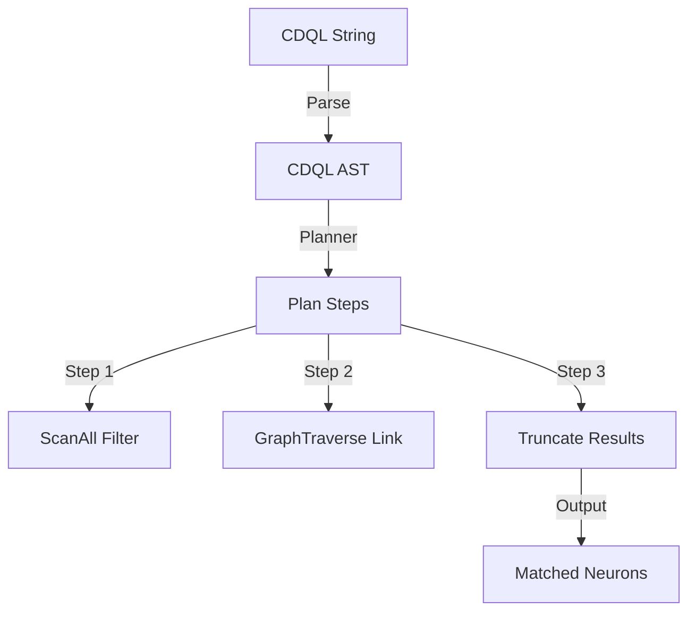

# 🔎 CDQL (Context-Driven Query Language) Template

This guide details the syntax and execution steps of the CDQL query language used in Cluaizd.

---

## 🏛️ CDQL Query Syntax

CDQL allows you to execute document filtering, vector scanning, and graph traversals in a single pipeline.

### Example Query:
```sql
find *(email: "aryan@example.com") -> get friends -> limit 10
```

---

## 🧬 CDQL Pipeline Execution Steps



---

## 🐍 Client Query Example

```python
import requests

BASE_URL = "http://127.0.0.1:8080"
HEADERS = {
    "x-tenant-id": "default_sandbox",
    "Content-Type": "application/json"
}

# Perform a hybrid CDQL query
payload = {
    "cdql": "find *(type: \"profile\", location: \"Delhi\") -> get friends -> limit 5"
}

response = requests.post(f"{BASE_URL}/query", headers=HEADERS, json=payload)
print(response.json())
```
