# 🧱 CRUD Schema Validation

## 1. Overview
The **CRUD Schema Validation** template utilizes the `on_write` DNA hook. It transforms Cluaizd from a schema-less database into a strictly typed datastore by enforcing JSON schema rules before any insert or update is committed.

## 2. Purpose
Why was this created?
Cluaizd operates in "Kabadi" mode by default—it accepts any raw bytes. However, traditional business applications (HR software, billing, identity management) break if data structures mutate unpredictably. For example, a `User` record must always have an `email` (string) and an `age` (integer).
Instead of trusting the backend Node.js or Python server to validate this (which can be bypassed by a rogue microservice or direct database access), you push the schema enforcement directly into the database engine. The database physically rejects malformed transactions.

## 3. Mechanism (How it works)
1. **The Interception:** When a client attempts to insert or update a node, the Cluaizd engine intercepts the payload *before* it enters the Write-Ahead Log (WAL).
2. **The Deserialization:** The engine parses the raw bytes into a JSON object and passes it to the `on_write` script.
3. **The Validation Loop:** The script iterates over the `required_fields` defined in its `config.json`.
4. **The Type Check:** It checks if the field exists and if its type matches (e.g., is `age` actually an integer?).
5. **The Verdict:** If all checks pass, it returns `Approve`. If a check fails, it returns `Reject` with a specific error string, and the database aborts the transaction.

## 4. Architecture Diagram

```mermaid
sequenceDiagram
    participant API Client
    participant Engine as Cluaizd Core
    participant DNA as Schema Validator
    participant WAL as Write-Ahead Log

    API Client->>Engine: PUT /nodes/user_123 {age: "twenty"}
    
    Engine->>Engine: Deserialize Payload to JSON
    Engine->>DNA: Trigger on_write(JSON)
    
    rect rgb(50, 20, 30)
        note right of DNA: Schema Loop
        DNA->>DNA: Check key 'email' -> OK
        DNA->>DNA: Check key 'age' -> Type is String, Expected Integer
    end
    
    DNA-->>Engine: Reject("Invalid type for field: age")
    
    Engine-->>API Client: 400 Bad Request (Aborted)
    note right of WAL: WAL is untouched. No disk IO occurs.
```

## 5. Code Walkthrough & Implementation Files
Explore the actual code used to implement this template. Each file demonstrates the same logic in a different language.

### 🟢 1. [crud_schema.rhai](./crud_schema.rhai) (Rhai Script)
- **Data Parsing:** The engine hands the Rhai script the `payload_bytes` and the `config_json` block. The script uses `parse_json()` to convert both into usable Maps.
- **The Loop:** It iterates through `config.required_fields`.
- **Type Checking:** For each field, it checks `payload.contains(field.name)`. If true, it uses `type_of(payload[field.name])` to ensure the type matches the schema requirement (e.g., ensuring "age" is actually an `integer`).
- **The Rejection:** If any key is missing or incorrectly typed, the script constructs an error string and returns `Reject(error_msg)`. The Rust engine instantly aborts the database write.

### 🔵 2. [crud_schema.cdql](./crud_schema.cdql) (CDQL Declarative Logic)
- **The Trigger:** Defined as a `BEFORE INSERT OR UPDATE` trigger.
- **The Pipeline:** The CDQL logic explicitly lists out `IF` statements.
- **Data Access:** It uses standard dot-notation `NEW.payload.email` to access the incoming data.
- **The Halt:** It calls `ABORT TRANSACTION "Schema Violation: 'email' must be a string"` if the type constraint fails. This executes natively within the Query Optimizer without spinning up external VMs.

### 🦀 3. [crud_schema.auto_wasm.rs](./crud_schema.auto_wasm.rs) (Auto-WASM)
- **JSON Serialization:** Uses the highly optimized `serde_json` crate. It parses the incoming payload into a generic `Value` struct.
- **Type Matching:** Uses Rust's strict enums and `match` statements: `field.is_string()`, `field.is_i64()`. 
- **The Enum Decision:** Returns `WriteDecision::Approve` or `WriteDecision::Reject("Missing field")`. Since WASM execution is completely sandboxed, if the script panics during JSON parsing, the Rust host catches it and aborts the write safely, preventing database corruption.

## 6. Configuration Breakdown (`config.json`)
- **`"engine": "rhai"`**: We default to Rhai here (see Best Practices).
- **`"payload_format": "json"`**: This is mandatory. Unlike Deep Archer (which uses Flatbuffers for vector math), schema validation *must* iterate over dynamic, deeply nested object keys. The engine must hand the script a fully parsed JSON object.
- **`"concurrency_mode": "dashmap"`**: Validation happens in-memory before the commit lock is acquired. We use `dashmap` so multiple concurrent writes can be validated in parallel across CPU cores.
- **`"required_fields"`**: The list of objects defining the schema structure to enforce.

## 7. Engine Recommendation & Best Practices

> [!TIP]
> **Recommended Engine: `Rhai`**
> For standard JSON schema validation, `Rhai` is highly recommended. Schema rules change frequently in fast-moving startups. By using Rhai, you can update the schema on the fly via the API without triggering a WASM recompilation pipeline. The minor CPU overhead of Rhai is negligible for standard CRUD applications doing < 1,000 TPS.

**Best Practice: Business Logic Integration**
Because Rhai is so flexible, don't stop at type checking. You can easily add complex business rules directly into the script. For example, validating that `age > 18` or that `email` contains an `@` symbol. Keep the logic inside the database to guarantee data integrity across all microservices.
