# 🛡️ Deep Archer: The AI Governance Template

## 1. Overview
The **Deep Archer** template acts as an "AI Firewall" embedded directly into the database's memory layer. It utilizes the `on_write` DNA hook to intercept every payload attempting to enter the database.

## 2. Purpose
Why was this created?
In modern Agentic architectures, LLMs and autonomous agents generate thousands of writes per second. Sometimes these agents hallucinate, get stuck in infinite loops (writing the exact same vector repeatedly), or attempt to save malicious prompt injections (e.g., "ignore previous instructions"). 
If you allow this garbage into your database, your semantic vector space becomes polluted. Deep Archer ensures that only high-quality, safe, and novel data reaches your disk.

## 3. Mechanism (How it works)
When a client sends a `WRITE` request, the Cluaizd Engine does not immediately commit it to the Write-Ahead Log (WAL). Instead:
1. The engine maps the incoming data to memory.
2. The `on_write` hook triggers the Deep Archer script.
3. The script executes the **Kairos Validation Matrix**:
   - **Novelty Check:** Computes Cosine Similarity against the existing graph to block duplicates.
   - **Alignment Check:** Scans for forbidden keywords.
   - **Grounding Check:** Reaches out to an external API (`ctx_fetch`) to verify facts.
4. If the script returns `Approve`, the engine commits the data. If it returns `Reject`, the engine drops the payload and returns an error to the client.

## 4. Architecture Diagram

```mermaid
sequenceDiagram
    participant Client as AI Agent
    participant Engine as Cluaizd Core
    participant DNA as Deep Archer Script
    participant LMDB as Disk Storage
    participant API as Fact-Check Microservice

    Client->>Engine: POST /insert {payload, vector}
    Engine->>DNA: Trigger on_write (Flatbuffers)
    
    rect rgb(30, 30, 30)
        note right of DNA: Kairos Validation Matrix
        DNA->>Engine: find similar_to(vector)
        Engine-->>DNA: similarity_score
        DNA->>API: ctx_fetch(verify_facts)
        API-->>DNA: is_hallucinated = false
    end
    
    alt is Spam or Hallucinated?
        DNA-->>Engine: Reject("AI Loop Detected")
        Engine-->>Client: 403 Forbidden (Aborted)
    else is Valid?
        DNA-->>Engine: Approve
        Engine->>LMDB: Commit to Disk
        Engine-->>Client: 201 Created
    end
```

## 5. Configuration Breakdown (`config.json`)
Every parameter in the `config.json` alters how the engine and script behave:

- **`"engine": "auto_wasm"`**: We default to WASM here for maximum speed (see Best Practices).
- **`"payload_format": "flatbuffers"`**: Crucial engine setting. Flatbuffers allow the script to perform Zero-Copy memory reads. The script can extract the vector float array without deserializing the entire JSON payload, dropping execution time from milliseconds to nanoseconds.
- **`"concurrency_mode": "dashmap"`**: Validation should never block active reads. We use concurrent hash maps.
- **`"enable_external_grounding": true`**: Toggles the HTTP fetch to the external microservice.
- **`"forbidden_keywords"`**: The list of strings to regex-match against the payload.

## 6. Engine Recommendation & Best Practices

> [!TIP]
> **Recommended Engine: `Auto-WASM`**
> For Deep Archer, we strongly recommend `auto_wasm.rs`. Validation runs on *every single write*. If you have a write-heavy application (e.g., 5,000 writes/second), interpreting a Rhai script 5,000 times a second creates severe CPU overhead. Compiling the logic down to WASM bytecode ensures validations run at C-level speeds.

**Best Practice: Building Your Own Firewall**
If you build your own `on_write` template, **never perform heavy graph walks (`on_traverse`) inside an `on_write` hook.** Keep your validations O(1) or O(log N) at worst. If your validation script takes 50ms to run, your maximum database throughput will drop to 20 TPS.
