# 🧠 Dreaming Engine: Subconscious Graph Traversal

## 1. Overview
The **Dreaming Engine** template utilizes the `on_dream` DNA hook. It allows the database to process data, forge new connections, and generate insights entirely in the background while the system is idle.

## 2. Purpose
Why was this created?
Most database compute cycles are wasted at 3 AM when user traffic drops to zero. In an Agentic Ecosystem, an AI should use this downtime to "sleep and dream"—consolidating memories and finding hidden relationships in the data that humans missed. This template turns dead server time into actionable insights.

## 3. Mechanism (How it works)
1. **The Idle Trigger:** The Cluaizd `heart` module monitors CPU/NPU usage. If metabolism drops below 20%, it fires the `SYSTEM.IDLE` event.
2. **The Anchor:** The script queries for a recently accessed node (the "Anchor").
3. **The Walk:** It performs a **Stochastic Graph Walk**. Instead of a rigid BFS/DFS, it randomly traverses edges to deep, forgotten parts of the graph.
4. **Resonance Check:** It mathematically compares the 16-D vector bitmask of the Anchor node with the final Destination node using Cosine Similarity.
5. **The Eureka Moment:** If the physical similarity is high (e.g., > 0.85) but no edge exists between them, the script creates a new `Hypothesis` edge, linking the two concepts forever.

## 4. Architecture Diagram

```mermaid
sequenceDiagram
    participant Heart as Telemetry (Heart)
    participant Engine as Cluaizd Core
    participant DNA as Dreaming Script
    participant LMDB as Graph Storage

    Heart->>Engine: Detects CPU Idle (<20%)
    Engine->>DNA: Trigger on_dream(time_budget)
    
    rect rgb(20, 40, 60)
        note right of DNA: Subconscious Processing
        DNA->>LMDB: Fetch recent Anchor Node
        DNA->>LMDB: Traversal (Stochastic Walk, depth=3)
        LMDB-->>DNA: Return Destination Node
        DNA->>DNA: Cosine Similarity(Anchor, Destination)
    end
    
    alt Similarity > 0.85 (Resonance)
        DNA->>Engine: forge_edge(Anchor, Dest, type="Hypothesis")
        Engine->>LMDB: Commit Mutex Lock
        DNA->>Engine: Log "EUREKA"
    else Low Similarity
        DNA->>Engine: Return No Insight
    end
```

## 5. Code Walkthrough & Implementation Files
Explore the actual code used to implement this template. Each file demonstrates the same logic in a different language.

### 🟢 1. [dream_walk.rhai](./dream_walk.rhai) (Rhai Script)
- **The Hook:** The script exports a function `on_dream(time_budget_ms)` which the engine calls during idle time.
- **The Loop:** It initiates a `while` loop, checking `ctx_elapsed_ms() < time_budget_ms`. If the system wakes up (API traffic hits), the budget drops to 0 and the loop safely exits.
- **The Traversal:** It calls `ctx_graph_random_walk(start_node_id, config.walk_depth)`. This function jumps randomly from node to node, exploring deep into the graph.
- **The Eureka Logic:** It fetches the vector embeddings of the start node and the final destination node. It runs `cosine_similarity(vec1, vec2)`. If the math returns > `0.85` (the eureka threshold), it triggers `ctx_graph_create_edge(node1, node2, "Hypothesis")`, permanently recording this AI "insight".

### 🔵 2. [dream_walk.cdql](./dream_walk.cdql) (CDQL Declarative Logic)
- **The Trigger:** `ON SYSTEM.IDLE EXECUTE PIPELINE`. This natively wires the script to the metabolism monitor.
- **Stochastic Walk:** CDQL has native syntax for random walks: `FIND RANDOM_NODE() -> TRAVERSE RANDOM_EDGES DEPTH 3 AS destination`.
- **The Filter & Merge:** The pipeline evaluates `WHERE SIMILAR_TO(destination.vector) > 0.85`. If true, it uses the native `MERGE EDGE "Hypothesis" BETWEEN origin AND destination` command. CDQL abstracts away all the looping and time-budget management, making it incredibly safe.

### 🦀 3. [dream_walk.auto_wasm.rs](./dream_walk.auto_wasm.rs) (Auto-WASM)
- **SDK Integration:** Built using `cluaizd_dna_sdk::prelude::*`. This is for massive production graphs where a stochastic walk requires millions of CPU instructions.
- **Memory Safety:** The script uses `ctx::query().node(id)` to load nodes directly from the `dashmap` cache.
- **Mathematical Intensity:** Cosine similarity across 1536-dimensional vectors is computationally heavy. Executing this inside the WASM sandbox allows the engine to utilize SIMD (Single Instruction, Multiple Data) CPU instructions, generating Eurekas 100x faster than the Rhai script.
- **Atomic Mutex:** When a Hypothesis edge is found, the WASM code issues a `Mutation::CreateEdge`. The engine momentarily acquires an exclusive Write Lock (`mutex`) on the specific graph shard, commits the edge atomically to prevent data corruption, and releases the lock.

## 6. Configuration Breakdown (`config.json`)
- **`"engine": "auto_wasm"`**: We default to WASM because graph traversal across millions of nodes requires raw compute speed.
- **`"payload_format": "flatbuffers"`**: The script only needs to read vector arrays to calculate cosine similarity. Zero-copy flatbuffers prevent deserialization bloat.
- **`"concurrency_mode": "mutex"`**: The dreaming engine mutates the graph (creates new edges). To prevent dirty reads from active API clients, the engine locks the specific shard during the Eureka commit. Since this only happens during IDLE time, contention is zero.
- **`"walk_depth"`**: How far down the graph the stochastic walk should travel.
- **`"eureka_threshold"`**: The Cosine Similarity float required to forge a new connection. Lowering this makes the AI "hallucinate" more creative connections.

## 7. Engine Recommendation & Best Practices

> [!TIP]
> **Recommended Engine: `Auto-WASM` or `CDQL`**
> For small graphs, `CDQL` is perfectly fine and highly readable. But if your graph has 10M+ edges, a Stochastic Walk is a heavy recursive operation. Writing your DNA in `auto_wasm.rs` ensures that the recursive jumps execute at C-level speed without blowing up the interpreter stack.

**Best Practice: Respecting the Time Budget**
The engine passes a `time_budget_ms` to your script. **Always check this budget.** If the system suddenly receives an API request, the `heart` will drop the idle budget to 0. Your script must gracefully exit immediately, or you will cause a massive latency spike for the end user.
