# 🕸️ Graph Edge Decay: Synaptic Pruning

## 1. Overview
The **Graph Edge Decay** template utilizes the `on_lifecycle` DNA hook. It mimics the biological process of "synaptic pruning"—automatically reducing the strength of unused graph connections and deleting them if they become completely irrelevant.

## 2. Purpose
Why was this created?
In standard graph databases (like Neo4j or Amazon Neptune), edges exist forever until an application developer explicitly runs a `DELETE` query. In a highly dynamic system (like a social network or an AI recommendation engine), this leads to graph bloat. A node might accumulate 10,000 edges over a year, slowing down traversal algorithms like PageRank or Shortest Path. 
By attaching this DNA script, the graph cleans itself autonomously. Edges that are frequently traversed grow stronger (Long-Term Potentiation), while untouched edges decay and vanish.

## 3. Mechanism (How it works)
1. **The GC Sweep:** A background Garbage Collection thread continuously evaluates nodes.
2. **The Execution:** The engine passes the node to the `on_lifecycle` hook.
3. **The Decay Math:** The script iterates over the node's outgoing edges. For each edge, it multiplies the current `weight` by the `decay_factor` (e.g., 0.95, a 5% loss).
4. **The Pruning Decision:** 
   - If the new weight is above the `pruning_threshold` (e.g., 0.1), the script sends an `update_edge` command.
   - If the new weight falls below the threshold, the script sends a `disconnect` command, severing the link forever.

## 4. Architecture Diagram

```mermaid
sequenceDiagram
    participant GC as GC Thread
    participant Engine as Cluaizd Core
    participant DNA as Graph Decay Script
    participant Memory as RCU Edge Array

    GC->>Engine: Sweep Node X
    Engine->>DNA: Trigger on_lifecycle(Node X)
    
    loop For each outgoing edge in Node X
        rect rgb(40, 50, 60)
            note right of DNA: Decay Math
            DNA->>DNA: new_weight = edge.weight * 0.95
        end
        
        alt new_weight < 0.1
            DNA-->>Engine: Action: disconnect(target_id)
            Engine->>Memory: RCU: Delete Edge (Lock-free)
        else new_weight >= 0.1
            DNA-->>Engine: Action: update_edge(new_weight)
            Engine->>Memory: RCU: Update Weight (Lock-free)
        end
    end
```

## 5. Code Walkthrough & Implementation Files
Explore the actual code used to implement this template. Each file demonstrates the same logic in a different language.

### 🟢 1. [graph_decay.rhai](./graph_decay.rhai) (Rhai Script)
- **The Iterator:** The script calls `neuron.edges()`, which returns an array of all outgoing edge objects.
- **The Loop:** It uses a `for` loop to iterate over each edge.
- **The Math:** `let new_weight = edge.weight * config.decay_factor;`
- **The Action Array:** Because Rhai is stateless, it cannot modify the DB directly. It constructs an array of action maps: `[ #{"action": "update_weight", "target": id, "weight": new_weight}, #{"action": "disconnect", "target": other_id} ]` and returns this array to the Rust engine to execute batch updates.

### 🔵 2. [graph_decay.cdql](./graph_decay.cdql) (CDQL Declarative Logic)
- **The Pipeline:** `ON SYSTEM.GC_SWEEP EXECUTE PIPELINE`.
- **Batch Update:** It natively loops the graph using `FIND TARGET.id -> TRAVERSE EDGES -> UPDATE weight = weight * CONFIG.decay_factor`.
- **Batch Delete:** The next pipeline step executes the prune: `WHERE weight < CONFIG.pruning_threshold -> DELETE`. This completely abstracts away the manual `for` loops required in Rhai and WASM.

### 🦀 3. [graph_decay.auto_wasm.rs](./graph_decay.auto_wasm.rs) (Auto-WASM)
- **Direct Memory Access:** Unlike Rhai which requires mapping edges to JSON, the WASM SDK allows you to directly iterate over the flatbuffer `edges()` array with zero copying.
- **C-Level Math:** The `f32` decay math happens natively inside the sandbox, which is critical when a node has 100,000 edges.
- **SDK Mutators:** Instead of returning a complex map of actions, the script directly calls `ctx::query().update_edge_weight()` and `ctx::query().disconnect()`. These commands are buffered in the WASM host and executed instantly via RCU pointers when the script exits.

## 6. Configuration Breakdown (`config.json`)
- **`"engine": "auto_wasm"`**: We default to WASM. Iterating over thousands of edges per node across millions of nodes requires the C-level looping speed of WASM to prevent the GC thread from falling behind.
- **`"payload_format": "json"`**: We do not need the payload at all to update edges, but `json` is a safe default. The engine will not deserialize the payload if the script only accesses the `edges()` iterator.
- **`"concurrency_mode": "dashmap"`**: This is critical. Modifying thousands of edges using `mutex` would lock the entire database and cause massive read latency for API clients. `dashmap` enables Read-Copy-Update (RCU). When an edge is pruned, active readers continue reading the old array pointer seamlessly.
- **`"decay_factor"`**: The multiplier (e.g., 0.95 = 5% decay per cycle).
- **`"pruning_threshold"`**: The float value below which the edge is permanently deleted.

## 7. Engine Recommendation & Best Practices

> [!TIP]
> **Recommended Engine: `Auto-WASM`**
> Graph structures can become incredibly dense (e.g., super-nodes with 100k+ edges). A Rhai script looping 100,000 times will severely bottleneck the GC thread. Always use `Auto-WASM` when iterating over large edge arrays.

**Best Practice: Super-Node Protection**
If you have known "super-nodes" (like a central `User` node that connects to everything), you might want to add a conditional check in your WASM code to skip pruning for specific Node IDs or Edge Types. Otherwise, the GC thread might aggressively prune critical architectural links.
