# 🔍 Hybrid Search: Reciprocal Rank Fusion (RRF)

## 1. Overview
The **Hybrid Search** template utilizes the `on_index` DNA hook. It intercepts the ranking evaluations generated during a search query and dynamically fuses Keyword (BM25) and Semantic (Vector) scores using Reciprocal Rank Fusion (RRF).

## 2. Purpose
Why was this created?
Standard databases force developers to choose between BM25 (Text) and HNSW (Vector) search. If a user searches for the exact phrase "Harry Potter 2", Vector search might return "Lord of the Rings" (semantically similar), while BM25 returns the exact text match.
By intercepting the `on_index` pipeline, you can execute a Hybrid Search. Cluaizd computes both indices simultaneously, hands the raw rankings to your DNA script, and lets you calculate the ultimate score. You get the best of both worlds natively in the database, without running Elasticsearch and Pinecone side-by-side.

## 3. Mechanism (How it works)
1. **The Query:** An API client sends a `search` command containing both a string and a vector float array.
2. **The Dual Indexing:** The engine evaluates the BM25 index and the HNSW graph concurrently.
3. **The Interception:** For every candidate node, the `on_index` hook triggers your script, passing in the `SearchEvaluation` object (containing `text_rank` and `vector_rank`).
4. **The Fusion:** The script applies the RRF formula: `1.0 / (k + rank)`.
5. **The Final Sort:** The script returns a single fused float score. The engine collects all scores, sorts the final result set, and returns it to the client.

## 4. Architecture Diagram

```mermaid
sequenceDiagram
    participant Client
    participant Core as Cluaizd Search Engine
    participant DNA as Hybrid Search Script
    
    Client->>Core: search(text="Apple", vector=[0.1, 0.2...])
    
    par Dual Evaluation
        Core->>Core: Evaluate BM25 Index (Text)
        Core->>Core: Evaluate HNSW Graph (Vector)
    end
    
    loop Per Candidate Node
        Core->>DNA: Trigger on_index(text_rank: 5, vector_rank: 2)
        
        rect rgb(60, 40, 20)
            note right of DNA: RRF Fusion Math
            DNA->>DNA: text_score = 1 / (60 + 5)
            DNA->>DNA: vector_score = 1 / (60 + 2)
            DNA->>DNA: final = (text_score * 0.4) + (vector_score * 0.6)
        end
        
        DNA-->>Core: return final_score
    end
    
    Core->>Core: Sort candidates by final_score DESC
    Core-->>Client: Return top 10 results
```


## 5. Code Walkthrough & Implementation Files
Explore the actual code used to implement this template. Each file demonstrates the same logic in a different language.

### 🟢 1. [hybrid_search.rhai](./hybrid_search.rhai) (Rhai Script)
- **Data Input:** The engine passes an `eval` object to the script containing two integers: `eval.text_rank` and `eval.vector_rank`.
- **The RRF Math:** The script executes:
  ```rust
  let text_score = 1.0 / (config.rrf_k + eval.text_rank);
  let vector_score = 1.0 / (config.rrf_k + eval.vector_rank);
  let final_score = (text_score * config.text_weight) + (vector_score * config.vector_weight);
  ```
- **The Output:** It returns `final_score`. The engine aggregates these floats and sorts the final list sent to the client.

### 🔵 2. [hybrid_search.cdql](./hybrid_search.cdql) (CDQL Declarative Logic)
- **The Interceptor:** `CREATE INTERCEPTOR RRF ON SEARCH`. This tells the Query Optimizer to hijack the standard ranking algorithm.
- **Native Execution:** CDQL natively supports mathematical overrides on ranks. It calculates the RRF formula directly in the database's internal projection step without firing up a sandbox.

### 🦀 3. [hybrid_search.auto_wasm.rs](./hybrid_search.auto_wasm.rs) (Auto-WASM)
- **Memory-Mapped Architecture:** When 10,000 nodes match a text query, parsing JSON to execute a Rhai script 10,000 times will cause severe search latency. Here, `payload.as_flatbuffer()` maps directly to the OS page cache.
- **Microsecond Execution:** The WASM script reads the integers and calculates the RRF floating-point math natively in the WebAssembly VM. 
- **Scalability:** By keeping the execution entirely in WASM, you can guarantee sub-5ms latency for complex Hybrid searches even at 1,000+ QPS.

## 6. Configuration Breakdown (`config.json`)
- **`"engine": "auto_wasm"`**: We default to WASM. This hook runs thousands of times per query (once for every candidate). C-level speed is mandatory.
- **`"payload_format": "flatbuffers"`**: Crucial. The script reads ranking metadata arrays. Zero-copy flatbuffers prevent deserialization latency, keeping execution time to nanoseconds.
- **`"concurrency_mode": "dashmap"`**: Search operations are read-only. `dashmap` allows thousands of concurrent searches to scale horizontally across CPU cores without global lock contention.
- **`"vector_weight"` & `"text_weight"`**: The fusion multipliers.
- **`"rrf_k"`**: The RRF smoothing constant (standard default is 60).

## 7. Engine Recommendation & Best Practices

> [!TIP]
> **Recommended Engine: `Auto-WASM`**
> Search latency is the most critical metric for any application. If a search query matches 10,000 nodes, the `on_index` hook executes 10,000 times in parallel. Using `Rhai` here will cause a massive latency spike (e.g., 200ms+ overhead). You must use `Auto-WASM` for production search fusion.

**Best Practice: Pruning Candidates**
If your custom scoring logic is extremely heavy, do not run it on every candidate. Add logic to instantly return a `0.0` score if the initial `text_rank` or `vector_rank` is beyond a certain threshold (e.g., > 1000), allowing the engine to instantly discard irrelevant nodes without heavy math.
