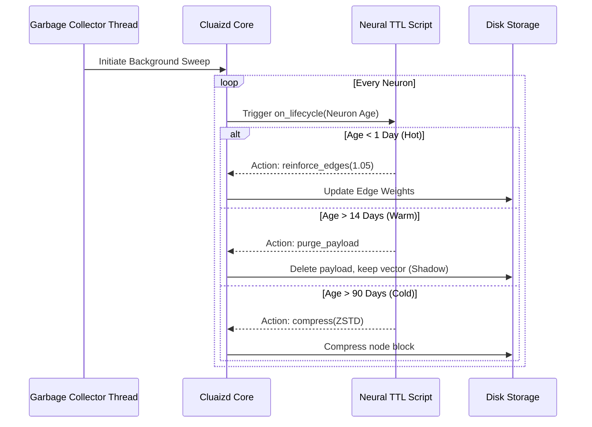

# 🕰️ Neural TTL: Biological Forgetting

## 1. Overview
The **Neural TTL** template utilizes the `on_lifecycle` DNA hook. It transforms static disk storage into a biological 3-Tier memory system (Hot -> Warm -> Cold) that gracefully forgets data over time rather than abruptly deleting it.

## 2. Purpose
Why was this created?
Most databases grow indefinitely until the disk is full, or they use simplistic "Time To Live" (TTL) rules that delete entire rows unconditionally after X days. 
In AI systems, a large document (1GB video or thick JSON) might become irrelevant after 14 days, but the *semantic meaning* (its vector) and its *relationships* (its graph edges) might still be crucial for intuition. This template allows the database to purge the heavy raw payload while retaining the lightweight vector and edges.

## 3. Mechanism (How it works)
1. **The GC Sweep:** A low-priority Garbage Collection (GC) thread constantly sweeps the `last_accessed` timestamps of neurons in the background.
2. **The Evaluation:** For each neuron, it passes the metadata to your DNA script.
3. **The 3-Tier Action:**
   - **Hot (< 1 Day Idle):** Actively used. The script sends a `reinforce_edges` command to physically strengthen its graph connections.
   - **Warm (> 14 Days Idle):** The script sends a `purge_payload_keep_vector` command. The engine deletes the heavy JSON/Bytes but keeps the 16-D vector bitmask. This is called "Shadow Intuition".
   - **Cold (> 90 Days Idle):** The script sends a `compress` command. The engine applies ZSTD compression (Level 19) to whatever is left and moves it to cold storage.

## 4. Architecture Diagram

## 5. Code Walkthrough & Implementation Files
Explore the actual code used to implement this template. Each file demonstrates the same logic in a different language.

### 🟢 1. [lifecycle.rhai](./lifecycle.rhai) (Rhai Script)
- **The Evaluation Phase:** The script receives a `neuron` object. It reads `neuron.last_accessed_ns` and compares it to the current time to calculate `idle_days`.
- **Threshold Matching:** It checks the `idle_days` against `config.warm_threshold_days` and `config.cold_threshold_days`.
- **The Action Map:** Rhai scripts in Cluaizd are stateless. They cannot mutate the database directly. Instead, the script returns an Action Map: `return #{"action": "compress"}` or `return #{"action": "purge_payload"}`. The Rust engine reads this map and executes the physical disk IO.

### 🔵 2. [lifecycle.cdql](./lifecycle.cdql) (CDQL Declarative Logic)
- **The Trigger:** `ON SYSTEM.GC_SWEEP`. This natively hooks into the background Garbage Collector.
- **Batch Processing:** Instead of evaluating one node at a time, CDQL executes in batches. 
- **The Queries:**
  - `UPDATE nodes SET payload = NULL WHERE last_accessed < SYSTEM.NOW - 14 DAYS` (This executes the Warm State purge).
  - `COMPRESS nodes WHERE last_accessed < SYSTEM.NOW - 90 DAYS` (This natively triggers the ZSTD engine).

### 🦀 3. [lifecycle.auto_wasm.rs](./lifecycle.auto_wasm.rs) (Auto-WASM)
- **High-Performance Parsing:** The WASM module uses `serde_json` to parse the TTL configuration.
- **Memory-Safe Mutators:** It utilizes `ctx::query().purge_payload(id)` and `ctx::query().compress(id)`. 
- **The RCU Mechanics:** When `purge_payload` is called, the WASM SDK does not block. It writes a Tombstone marker to the node's payload pointer. Active reads hitting that node will return a `Payload Purged` error without crashing, while new writes will allocate fresh memory. The actual disk space is reclaimed during the midnight LMDB compaction cycle.

## 6. Configuration Breakdown (`config.json`)
- **`"engine": "cdql"`**: We default to CDQL here. Background queries and batch updates are the exact scenarios where native query languages shine in readability and safety.
- **`"payload_format": "json"`**: We use JSON because `on_lifecycle` might need to inspect nested payload properties before deciding to purge them. Since it runs in a low-priority background thread, the deserialization overhead does not impact active API latency.
- **`"concurrency_mode": "dashmap"`**: Critical setting. If we used `mutex`, the GC thread would lock the database, causing massive lag spikes for users. Using `dashmap` enables Read-Copy-Update (RCU). When the TTL script purges a payload, it writes a tombstone without blocking concurrent reads.
- **`"warm_threshold_days"` & `"cold_threshold_days"`**: The exact thresholds for the biological decay curve.

## 7. Engine Recommendation & Best Practices

> [!TIP]
> **Recommended Engine: `CDQL`**
> For Garbage Collection tasks, `CDQL` is highly recommended. It uses declarative `TRIGGER` syntax that DBA's are intimately familiar with. If your logic requires complex mathematical decay curves (like Fourier transforms), switch to `Auto-WASM`. 

**Best Practice: The Tombstone Reality**
When the engine purges a payload, it doesn't instantly reclaim disk space in LMDB due to MVCC (Multi-Version Concurrency Control). It creates a tombstone. Real disk space is only reclaimed during the engine's midnight compaction cycle. Do not write TTL scripts expecting instant disk defragmentation.
