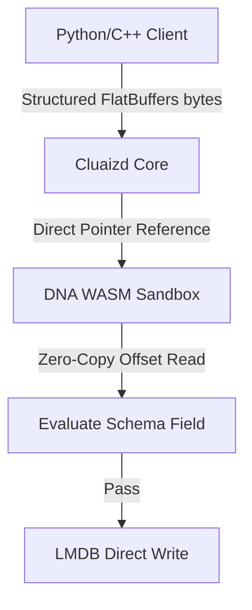

# 📦 Binary Serialization Paradigms: FlatBuffers & Protobuf

This guide explains how Cluaizd processes high-performance binary serialization formats (**FlatBuffers** and **Protobuf**) and how they interact with dynamic DNA validation hooks.

---

## 🏛️ FlatBuffers vs Protobuf vs JSON

In high-throughput systems (like Robotics sensor fusion and BCI telemetry streams), JSON parsing introduces a heavy CPU deserialization tax. Cluaizd supports structured binary formats to optimize ingestion speeds:

| Feature | JSON | Protocol Buffers (Protobuf) | FlatBuffers |
| --- | --- | --- | --- |
| **Parsing Overhead** | High (String parsing) | Medium (Deserialization required) | **Zero-Copy** (Direct memory cast) |
| **Data Format** | Text | Binary | Binary |
| **Schema Required** | No (Schema-less) | Yes (`.proto`) | Yes (`.fbs`) |
| **Use Case** | Web APIs, dynamic data | Microservices, structured tables | Real-time streams, game state logs |

---

## 🧬 Binary Payloads & The DNA Layer

When `payload_format` is set to `protobuf` or `flatbuffers`, the neuron's `raw_payload` stores structured binary segments instead of JSON text.

Since **FlatBuffers** is zero-copy, the DNA WASM engine reads attributes directly from the memory pointer of the raw bytes without deserializing the payload:



---

## 🛠️ Schema Configurations

### 1. FlatBuffers Schema Template (`user.fbs`)

```protobuf
// user.fbs
namespace Cluaizd.Serial;

table UserProfile {
  id: string;
  username: string;
  age: int;
  active: bool;
}

root_type UserProfile;
```

#### WASM DNA Validation (Zero-Copy offset reading in Rust):
```rust
// Inside WASM DNA module
// Checks the FlatBuffers byte array directly without deserializing

#[no_mangle]
pub extern "C" fn validate(payload_ptr: *const u8, _payload_len: u32, _vector_ptr: *const f32) -> i32 {
    let payload = unsafe { std::slice::from_raw_parts(payload_ptr, _payload_len as usize) };
    
    // FlatBuffers stores offsets at the start of the buffer.
    // Read age property at offset 12 (as defined by user.fbs table offsets)
    if payload.len() > 16 {
        let age_offset = payload[12] as usize;
        if age_offset < 18 {
            return 0; // Abort: Underage user
        }
    }
    
    1 // Allow
}
```

---

### 2. Protobuf Schema Template (`sensor.proto`)

```protobuf
// sensor.proto
syntax = "proto3";
package cluaizd.sensor;

message TelemetryPacket {
  string device_id = 1;
  uint64 timestamp_ms = 2;
  repeated float voltages = 3;
}
```

#### Rhai DNA Validation (Using JSON conversions):
```rust
// genomes/protobuf_check.rhai
// Parses decoded protobuf parameters

let packet = json(payload); // Decoded message passed to Rhai

// Ensure voltage is not empty
if packet.voltages.len() == 0 {
    return #{
        "action": "Abort",
        "error": "Protobuf validation failed: voltages list is empty."
    };
}

return #{
    "action": "Allow"
};
```
