# 📉 Time Series Downsampling

## 1. Overview
The **Time Series Downsampling** template utilizes the `on_lifecycle` DNA hook to manage high-frequency data streams (e.g., IoT sensors, stock market ticks, server CPU metrics). It automatically aggregates historical data into larger time buckets to save disk space.

## 2. Purpose
Why was this created?
If your server records CPU temperature every second, that's 86,400 data points per day. For the last 24 hours, you need that per-second granularity for real-time alerting. But looking at data from 30 days ago, you only care about the *hourly average*.
Standard Time Series databases (like InfluxDB) have hardcoded downsampling rules. Cluaizd allows you to script exactly how the downsampling occurs, allowing you to use custom math (e.g., taking the 95th percentile instead of a simple average) directly inside the Garbage Collection pipeline.

## 3. Mechanism (How it works)
1. **The GC Sweep:** The background Garbage Collection thread continuously evaluates neurons.
2. **Age Evaluation:** It checks the `timestamp` of the neuron. If the age exceeds `downsample_threshold_days`, it triggers the downsampling block.
3. **The Grouping:** The engine clusters all raw neurons within the target `target_granularity_hours` bucket.
4. **The Aggregation:** It applies an aggregation function (like `avg()` or `max()`) to the payload values.
5. **The Merge:** It creates a single new consolidated neuron and physically deletes the thousands of raw high-frequency neurons.

## 4. Architecture Diagram

```mermaid
sequenceDiagram
    participant GC as GC Thread
    participant Engine as Cluaizd Core
    participant DNA as Downsampling Script
    participant Disk as LMDB

    GC->>Engine: Sweep Time-Series Nodes
    Engine->>DNA: Trigger on_lifecycle
    
    rect rgb(30, 50, 40)
        note right of DNA: Age Check
        DNA->>DNA: Is Node > 7 Days Old?
    end
    
    alt Yes (Requires Downsampling)
        DNA->>Engine: Execute GroupBy(1 Hour Bucket)
        Engine->>Engine: Calculate Average Payload Value
        Engine->>Disk: Insert 1 Hourly Node
        Engine->>Disk: Delete 3600 Per-Second Nodes
    else No (Recent Data)
        DNA-->>Engine: Action: None
    end
```

## 5. Code Walkthrough & Implementation Files
Explore the actual code used to implement this template. Each file demonstrates the same logic in a different language.

### 🟢 1. [time_series_decay.rhai](./time_series_decay.rhai) (Rhai Script)
- **The Execution Context:** Executed on individual nodes. It checks `neuron.age_ns`.
- **The Grouping Command:** Since Rhai cannot natively perform SQL-like `GROUP_BY` across millions of rows efficiently, it has to construct a complex action map: `#{"action": "downsample", "granularity": config.target_granularity_hours}` and return it to the Rust engine to execute the actual grouping math.

### 🔵 2. [time_series.cdql](./time_series.cdql) (CDQL Declarative Logic)
- **The Trigger:** `ON SYSTEM.GC_SWEEP`.
- **The Vectorized Math:** CDQL completely outclasses Rhai here. It uses native syntax: `GROUP_BY time_bucket(CONFIG.target_granularity_hours) -> AGGREGATE avg(payload.value) as avg_value`.
- **The Resolution:** It uses `MERGE INTO new_downsampled_node -> DELETE TARGET` to finalize the aggregation in a single query pipeline step.

### 🦀 3. [time_series.auto_wasm.rs](./time_series.auto_wasm.rs) (Auto-WASM)
- **Age Calculation:** Reads `neuron.timestamp()` and does saturating math against the current epoch to find `days_old`.
- **SDK Execution:** If the threshold is passed, it delegates the heavy lifting to the SDK: `ctx::query().downsample(neuron.id(), config.target_granularity_hours).execute()`. This tells the Rust engine to launch a highly optimized multi-threaded downsampling task for that specific time bucket.

## 6. Configuration Breakdown (`config.json`)
- **`"engine": "cdql"`**: We default to CDQL here. CDQL was built specifically for data aggregation. Native `GROUP_BY time_bucket` syntax is vastly superior to writing complex time-bucketing loops in WASM or Rhai.
- **`"payload_format": "json"`**: The script needs to read and average numerical payload fields (e.g., `payload.temperature`). The engine must deserialize the payload.
- **`"concurrency_mode": "dashmap"`**: Critical. The downsampling process touches millions of nodes. If we used `mutex`, the GC thread would lock the database, blocking incoming high-frequency IoT writes. `dashmap` allows the engine to ingest new real-time ticks concurrently while safely purging historical data.
- **`"downsample_threshold_days"`**: How long to keep the raw, high-frequency data.
- **`"target_granularity_hours"`**: The new bucket size for historical data.

## 7. Engine Recommendation & Best Practices

> [!TIP]
> **Recommended Engine: `CDQL`**
> For data aggregation, always use `CDQL`. The Cluaizd Query Optimizer can execute CDQL `GROUP_BY` and `AGGREGATE` functions 10x faster than a custom loop written in WASM because it utilizes internal vectorized CPU instructions. 

**Best Practice: Staggered Downsampling**
In production, don't just have one downsampling rule. Chain them together! For example, write a script that downsamples to *Hourly* after 7 days, and then another block that downsamples to *Daily* after 90 days. This creates a beautifully optimized storage curve.
