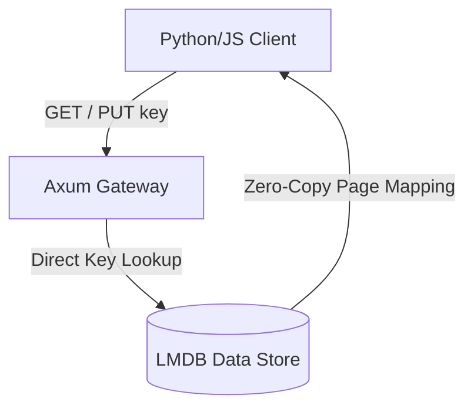

# ⚡ Mode 01: Key-Value Store Paradigm (Redis-Style)

This guide details how to configure and run Cluaizd as a hyper-performance, memory-mapped key-value store (analogous to Redis or Memcached), leveraging the zero-copy LMDB engine and bypassing complex query compilation for absolute raw speed.

---

## 🏛️ Conceptual Mapping & Architecture

In Key-Value mode, Cluaizd operates as a direct $O(1)$ mapping of unique keys to raw binary or string values. By bypassing the DNA evaluation hooks for simple lookups, the engine reaches sub-microsecond access latencies directly on local hardware.



### Key Parameters:
- **Core Strategy:** Direct lookup via deterministic key mapping.
- **Latency Target:** $< 50\mu s$ on local thread pools.
- **Memory Footprint:** Memory-mapped (`mmap`) page allocation with Hot State tiering.

---

## 🗄️ Server Configuration (`cluaizd.toml`)

Configure the tenant shard to use the lock-free `dashmap` concurrency engine and keep payloads in raw binary formatting for minimal translation tax:

```toml
[server]
host = "127.0.0.1"
port = 6379

[database]
concurrency_mode = "dashmap"
payload_format = "json"
default_map_size_mb = 4096 # 4GB map size
```

---

## 🧬 The DNA Script (`genomes/key_value.rhai`)

To enforce basic TTL (Time-To-Live) and expiry rules dynamically, attach this script to the neuron's lifecycle hook:

```rust
// genomes/key_value.rhai
// Dynamic key-value retention and automatic pruning rules

let age_ns = neuron.age_ns;
let ttl_seconds = config.ttl_seconds;

// If TTL has expired, trigger automatic deletion (apoptosis)
if age_ns > (ttl_seconds * 1000000000) {
    return #{
        "delete_neuron": true,
        "action": "Expire"
    };
}

return #{
    "delete_neuron": false
};
```

---

## 🐍 Client Implementation Examples

### Python Client (Direct REST Interaction)

```python
import requests
import json
import uuid

BASE_URL = "http://127.0.0.1:8080"
HEADERS = {
    "x-tenant-id": "kv_sandbox",
    "Content-Type": "application/json"
}

def set_key(key: str, value: str, ttl_seconds: int = 3600):
    # Derive deterministic UUID from string key name
    key_uuid = str(uuid.uuid5(uuid.NAMESPACE_DNS, key))
    
    payload = {
        "raw_payload": value,
        "vector_data": [0.0] * 16, # Dummy vector for key-value storage
        "model_creator_hash": "00" * 32,
        "payload_type": "text",
        "dna": {
            "on_write": None,
            "on_read": None,
            "on_index": None,
            "on_traverse": None,
            "on_dream": None,
            "on_lifecycle": "let age_ns = neuron.age_ns; if age_ns > (config.ttl * 1000000000) { return #{\"delete_neuron\": true}; } return #{\"delete_neuron\": false};",
            "parameters": {"ttl": ttl_seconds},
            "engine": "rhai"
        }
    }
    
    response = requests.post(f"{BASE_URL}/neuron", headers=HEADERS, json=payload)
    return response.json()

def get_key(key: str):
    key_uuid = str(uuid.uuid5(uuid.NAMESPACE_DNS, key))
    response = requests.get(f"{BASE_URL}/neuron/{key_uuid}", headers=HEADERS)
    if response.status_code == 200:
        return response.json()["raw_payload"]
    return None

# Usage
set_key("user:session:100", "active_authenticated_state", ttl_seconds=600)
print("Session State:", get_key("user:session:100"))
```

### JavaScript Client (Node.js)

```javascript
const axios = require('axios');
const crypto = require('crypto');

const BASE_URL = "http://127.0.0.1:8080";
const TENANT_ID = "kv_sandbox";

// Helper to generate a deterministic UUIDv5 namespace equivalent
function generateKeyUuid(key) {
    return crypto.createHash('sha256').update(key).digest('hex').substring(0, 32);
}

async function setKey(key, value, ttlSeconds = 3600) {
    const neuronId = generateKeyUuid(key);
    const payload = {
        raw_payload: value,
        vector_data: new Array(16).fill(0.0),
        model_creator_hash: "0".repeat(64),
        payload_type: "text",
        dna: {
            on_lifecycle: "let age_ns = neuron.age_ns; if age_ns > (config.ttl * 1000000000) { return #{\"delete_neuron\": true}; } return #{\"delete_neuron\": false};",
            parameters: { ttl: ttlSeconds },
            engine: "rhai"
        }
    };

    const response = await axios.post(`${BASE_URL}/neuron`, payload, {
        headers: { 'x-tenant-id': TENANT_ID }
    });
    return response.data;
}

async function getKey(key) {
    const neuronId = generateKeyUuid(key);
    try {
        const response = await axios.get(`${BASE_URL}/neuron/${neuronId}`, {
            headers: { 'x-tenant-id': TENANT_ID }
        });
        return response.data.raw_payload;
    } catch (error) {
        return null;
    }
}
```

---

## 📈 Business & Research Applications

- **Dynamic Session Storage:** Storing short-lived JWT tokens or user state tags with low latency.
- **Edge Cache:** Perfect for running as a zero-configuration embedded database inside robotic microcontrollers to store current motor telemetry states.
