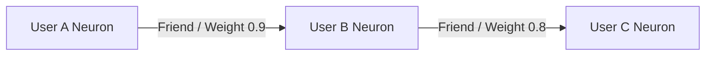

# 🕸️ Mode 02: Graph Database Paradigm (Neo4j-Style)

This guide details how to configure and run Cluaizd as a high-performance Graph Database, utilizing the co-located `adjacency` edge list of the `UniversalNeuron` and fast Specular bitwise intersections for nanosecond traversal.

---

## 🏛️ Conceptual Mapping & Architecture

In Graph Mode, entities (nodes) are represented as `UniversalNeuron` instances. Relationships (edges) are stored directly inside the `adjacency` field of each neuron, establishing **Index-free Adjacency**. Specular Graph Traversal computes spatial signatures on-the-fly to perform graph relationship checks at hardware speed.



### Key Parameters:
- **Core Strategy:** Direct lookup via adjacency arrays inside neurons.
- **Pruning Hook:** `on_traverse` is evaluated to filter edge traversal routes based on dynamic weights.
- **Specular Fast-Path:** Bitwise structural check to verify mutual connections in $O(1)$ time.

---

## 🧬 The DNA Script (`genomes/graph_traverse.rhai`)

To enforce traversal logic (e.g. only follow edges above a specific weight limit), attach this script to the neuron's `on_traverse` hook:

```rust
// genomes/graph_traverse.rhai
// Dynamic graph traversal edge check

let edge_weight = edge_weight; // Provided by runtime
let min_threshold = config.min_weight;

if edge_weight >= min_threshold {
    return #{
        "follow": true
    };
}

return #{
    "follow": false
};
```

---

## 🗄️ Server Configuration (`cluaizd.toml`)

Configure the tenant shard to use `mutex` or `dashmap` depending on cluster distribution:

```toml
[server]
host = "127.0.0.1"
port = 8080

[database]
concurrency_mode = "mutex"
payload_format = "json"
```

---

## 🐍 Client Implementation Examples

### Python Client (Creating Relationships & Traversing)

```python
import requests
import json

BASE_URL = "http://127.0.0.1:8080"
HEADERS = {
    "x-tenant-id": "graph_sandbox",
    "Content-Type": "application/json"
}

def create_person(name: str):
    payload = {
        "raw_payload": json.dumps({"name": name, "type": "person"}),
        "vector_data": [0.0] * 16,
        "model_creator_hash": "00" * 32,
        "payload_type": "text"
    }
    response = requests.post(f"{BASE_URL}/neuron", headers=HEADERS, json=payload)
    return response.json()["neuron_id"]

def connect_people(source_id: str, target_id: str, weight: float):
    # Retrieve source neuron
    resp = requests.get(f"{BASE_URL}/neuron/{source_id}", headers=HEADERS)
    source_neuron = resp.json()
    
    # Add target edge
    adjacency = source_neuron.get("adjacency", [])
    adjacency.append({
        "target_id": target_id,
        "weight": weight
    })
    
    # Update source neuron
    payload = {
        "raw_payload": source_neuron["raw_payload"],
        "vector_data": source_neuron["vector_data"],
        "model_creator_hash": "00" * 32,
        "payload_type": "text",
        "adjacency": adjacency,
        "dna": {
            "on_traverse": "if edge_weight > 0.5 { return #{\"follow\": true}; } return #{\"follow\": false};",
            "parameters": {},
            "engine": "rhai"
        }
    }
    requests.post(f"{BASE_URL}/neuron", headers=HEADERS, json=payload)

# Usage
alice = create_person("Alice")
bob = create_person("Bob")
connect_people(alice, bob, 0.9)

# Traverse Graph
traverse_resp = requests.get(f"{BASE_URL}/graph/{alice}/traverse?depth=2", headers=HEADERS)
print("Subgraph nodes:", traverse_resp.json())
```

---

## 📈 Business & Research Applications

- **Social Network Graphs:** Direct modeling of user relations with dynamic real-world weight decay.
- **Enterprise Knowledge Graphs:** Connecting various entity nodes (companies, products, concepts) for advanced semantic inferences.
- **Robotics Pathfinding:** Muscle trajectory checkpoints connected together as adjacency paths.
