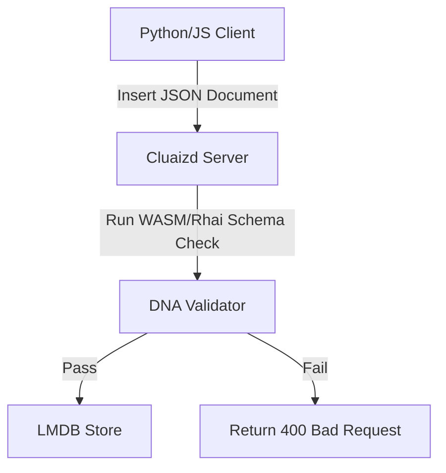

# 📑 Mode 03: Document Store Paradigm (MongoDB-Style)

This guide details how to configure and run Cluaizd as a high-performance Document Database, utilizing schema-less JSON payloads and dynamic DNA rules to perform deep filtering and verification.

---

## 🏛️ Conceptual Mapping & Architecture

In Document Mode, records are stored as JSON strings in the neuron's `raw_payload`. Unlike traditional relational tables, there are no predefined columns. Schema compliance is enforced at runtime using DNA write validation scripts, allowing developers to scale out without structured lock-in.



---

## 🗄️ Server Configuration (`cluaizd.toml`)

Set the default serialization format to `json` for document indexing:

```toml
[server]
host = "127.0.0.1"
port = 8080

[database]
concurrency_mode = "dashmap"
payload_format = "json"
```

---

## 🧬 The DNA Script (`genomes/document_schema.rhai`)

To enforce strict structural validation on write (e.g. verify specific fields exist in the JSON payload), use this script:

```rust
// genomes/document_schema.rhai
// Validate JSON structure and verify required fields

let payload_str = payload; // Exposed by Rhai when payload is Text
let doc = json(payload_str);

// Check if required fields exist
if doc.name == "" || doc.email == "" {
    return #{
        "action": "Abort",
        "error": "Document must contain a non-empty name and email."
    };
}

return #{
    "action": "Allow",
    "sync_write": "lite"
};
```

---

## 🐍 Client Implementation Examples

### Python Client (Adding and Querying Documents)

```python
import requests
import json

BASE_URL = "http://127.0.0.1:8080"
HEADERS = {
    "x-tenant-id": "document_sandbox",
    "Content-Type": "application/json"
}

def insert_document(doc: dict):
    payload = {
        "raw_payload": json.dumps(doc),
        "vector_data": [0.0] * 16,
        "model_creator_hash": "00" * 32,
        "payload_type": "text",
        "dna": {
            "on_write": "let payload_str = payload; let doc = json(payload_str); if doc.email == \"\" { return #{\"action\": \"Abort\", \"error\": \"Missing email\"}; } return #{\"action\": \"Allow\"};",
            "parameters": {},
            "engine": "rhai"
        }
    }
    response = requests.post(f"{BASE_URL}/neuron", headers=HEADERS, json=payload)
    return response.json()

def find_documents(query_str: str):
    # Query using CDQL filtering
    payload = {
        "tenant_id": "document_sandbox",
        "cdql": query_str
    }
    response = requests.post(f"{BASE_URL}/query", headers=HEADERS, json=payload)
    return response.json()

# Usage
insert_document({"name": "Aryan", "email": "aryan@example.com", "age": 25})
results = find_documents("find *(email: \"aryan@example.com\")")
print("Search Results:", results)
```

---

## 📈 Business & Research Applications

- **Content Management Systems (CMS):** Storing flexible article pages, comments, and configurations.
- **E-Commerce Catalogs:** Storing product records with variable properties and attributes without database schemas.
