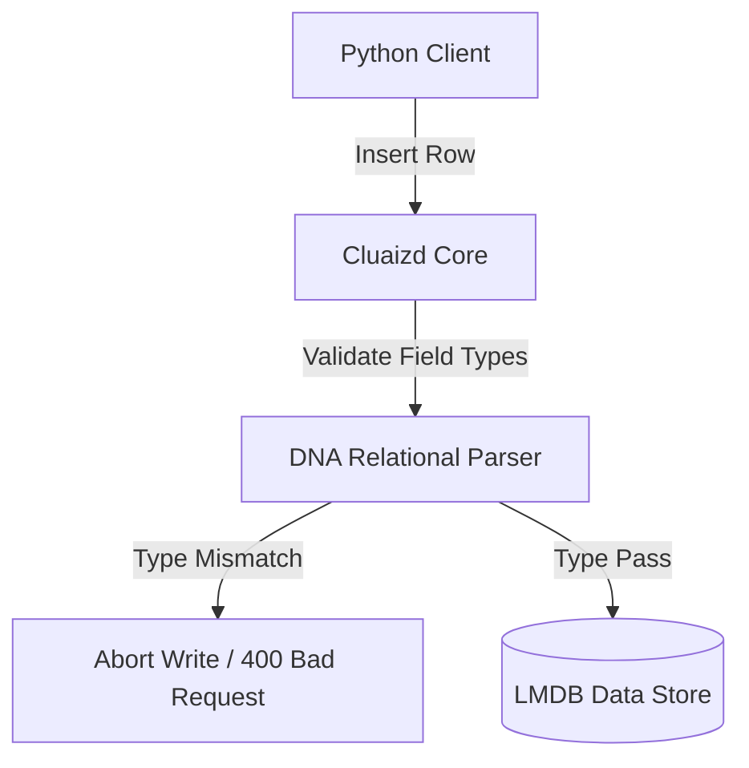

# 🗄️ Mode 04: Relational Database Paradigm (PostgreSQL-Style)

This guide details how to configure and run Cluaizd as a relational data engine, simulating schema enforcement, multi-table structural mapping, and transaction rules through core DNA controls.

---

## 🏛️ Conceptual Mapping & Architecture

In Relational Mode, structured tables and foreign keys are simulated by establishing strict constraints. Schema columns are defined via the DNA configuration parameters, and writes that violate these field types are rejected immediately. 



---

## 🗄️ Server Configuration (`cluaizd.toml`)

Enforce sequential execution order via `mutex` to prevent multi-thread write conflicts on structured tables:

```toml
[server]
host = "127.0.0.1"
port = 8080

[database]
concurrency_mode = "mutex"
payload_format = "json"
```

---

## 🧬 The DNA Script (`genomes/relational_schema.rhai`)

To enforce relational schema type constraints (e.g. check if `age` is an integer and `name` is a string), use this write hook script:

```rust
// genomes/relational_schema.rhai
// Relational schema constraints validation

let payload_str = payload;
let row = json(payload_str);

// Enforce types
if type_of(row.name) != "string" {
    return #{
        "action": "Abort",
        "error": "Column 'name' must be a String"
    };
}

if type_of(row.age) != "int" {
    return #{
        "action": "Abort",
        "error": "Column 'age' must be an Integer"
    };
}

return #{
    "action": "Allow"
};
```

---

## 🐍 Client Implementation Examples

### Python Client (Simulating Table Operations)

```python
import requests
import json

BASE_URL = "http://127.0.0.1:8080"
HEADERS = {
    "x-tenant-id": "relational_sandbox",
    "Content-Type": "application/json"
}

def insert_row(table_name: str, row_data: dict):
    # Pack row data with table metadata
    row_data["_table"] = table_name
    
    payload = {
        "raw_payload": json.dumps(row_data),
        "vector_data": [0.0] * 16,
        "model_creator_hash": "00" * 32,
        "payload_type": "text",
        "dna": {
            "on_write": "let payload_str = payload; let row = json(payload_str); if type_of(row.name) != \"string\" { return #{\"action\": \"Abort\", \"error\": \"Column name must be string\"}; } return #{\"action\": \"Allow\"};",
            "parameters": {},
            "engine": "rhai"
        }
    }
    response = requests.post(f"{BASE_URL}/neuron", headers=HEADERS, json=payload)
    return response.json()

# Usage
insert_row("users", {"name": "Aryan", "age": 25})
```

---

## 📈 Business & Research Applications

- **Financial Transactions:** Recording strict ledger balances that must conform to structured schemas.
- **Account Credentials:** Managing system authorization profiles with static user table formatting.
