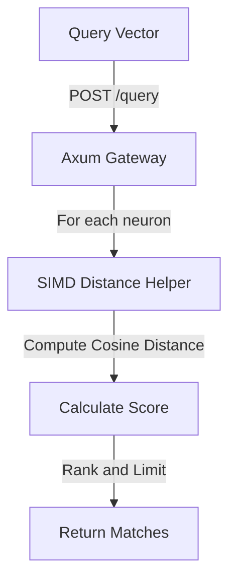

# 🧠 Mode 05: Vector / AI Database Paradigm (Pinecone-Style)

This guide details how to configure and run Cluaizd as a high-performance Vector Database, leveraging native SIMD calculations (`cosine_similarity`) and hybrid filters within DNA scripts.

---

## 🏛️ Conceptual Mapping & Architecture

In Vector Mode, neurons contain 16-dimensional float footprints (`vector_data`) alongside raw text or media payloads. Similarity checks (like Cosine or Euclidean distance) are computed by registering Rust SIMD calculation loops directly into the Rhai environment, bypassing costly model decoding taxes at query time.



---

## 🗄️ Server Configuration (`cluaizd.toml`)

Set concurrency settings to `dashmap` to maximize read query throughput:

```toml
[server]
host = "127.0.0.1"
port = 8080

[database]
concurrency_mode = "dashmap"
payload_format = "json"
```

---

## 🧬 The DNA Script (`genomes/vector_similarity.rhai`)

To calculate vector similarity using the registered SIMD helper, attach this script to the neuron's `on_index` hook:

```rust
// genomes/vector_similarity.rhai
// Calculate cosine similarity distance against query vector

let vec = vector_data; // Pre-loaded neuron vector
let query = query_vector; // Passed in query request

if query.len() == 0 {
    return #{
        "score": 0.0
    };
}

let similarity = cosine_similarity(vec, query);

return #{
    "score": similarity,
    "distance": 1.0 - similarity
};
```

---

## 🐍 Client Implementation Examples

### Python Client (Adding and Searching Vectors)

```python
import requests
import json

BASE_URL = "http://127.0.0.1:8080"
HEADERS = {
    "x-tenant-id": "vector_sandbox",
    "Content-Type": "application/json"
}

def insert_vector(text: str, vector: list):
    payload = {
        "raw_payload": text,
        "vector_data": vector,
        "model_creator_hash": "a4d3" * 16, # Reference creator model hash
        "payload_type": "text"
    }
    response = requests.post(f"{BASE_URL}/neuron", headers=HEADERS, json=payload)
    return response.json()

def search_similar(query_vector: list, limit: int = 5):
    # Attach DNA script to rank search results
    payload = {
        "tenant_id": "vector_sandbox",
        "query_vector": query_vector,
        "limit": limit
    }
    # Create the search hook
    dna = {
        "on_index": "let vec = vector_data; let query = query_vector; if query.len() == 0 { return #{\"score\": 0.0}; } let sim = cosine_similarity(vec, query); return #{\"score\": sim};",
        "parameters": {},
        "engine": "rhai"
    }
    
    # We query all nodes using this DNA index hook
    response = requests.post(f"{BASE_URL}/query", headers=HEADERS, json={
        "tenant_id": "vector_sandbox",
        "query_vector": query_vector,
        "limit": limit
    })
    return response.json()

# Usage
insert_vector("Cluaizd database architecture", [0.1] * 16)
results = search_similar([0.1] * 16)
print("Search Results:", results)
```

---

## 📈 Business & Research Applications

- **Semantic Document Search:** Retrieval-Augmented Generation (RAG) context matching.
- **Image/Audio Matching:** Finding visual patterns by checking distances between media embeddings.
