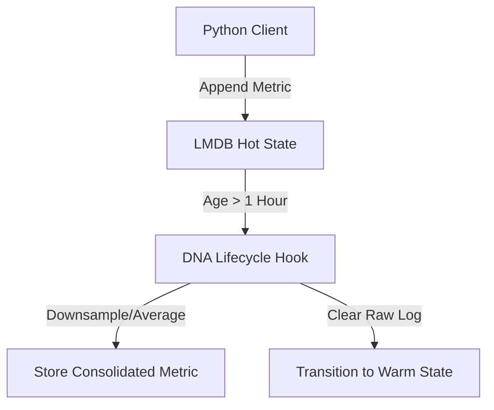

# ⏱️ Mode 06: Time-Series Database Paradigm (InfluxDB-Style)

This guide details how to configure and run Cluaizd as a Time-Series Database, focusing on high-frequency metrics logging, time-window aggregations, and automatic downsampling via DNA lifecycle rules.

---

## 🏛️ Conceptual Mapping & Architecture

In Time-Series Mode, metrics are stored as timestamped log events inside the neuron's payload. The creation timestamp (`created_at_ns`) acts as the primary indexing timeline. When the neuron ages past configured boundaries, the DNA `on_lifecycle` hook fires to compress or aggregate (downsample) old granular values.



---

## 🗄️ Server Configuration (`cluaizd.toml`)

Enable lock-free writing via `dashmap` to support high-throughput append-only workloads:

```toml
[server]
host = "127.0.0.1"
port = 8080

[database]
concurrency_mode = "dashmap"
payload_format = "json"
```

---

## 🧬 The DNA Script (`genomes/time_series_decay.rhai`)

To implement downsampling (e.g. clear granular logs and keep only daily metrics summary as the neuron ages), attach this script to the lifecycle hook:

```rust
// genomes/time_series_decay.rhai
// Time-series lifecycle downsampling and payload pruning

let age_ns = neuron.age_ns;

// 1 Hour in nanoseconds = 3,600,000,000,000 ns
if age_ns > 3600000000000 {
    let payload_str = payload;
    let data = json(payload_str);
    
    // Average or consolidate metrics (e.g. keep summary log, discard raw data)
    let consolidated = #{
        "average_voltage": data.avg,
        "summary": "Consolidated after 1 hour"
    };

    return #{
        "clear_payload": true,
        "new_tier": "Warm",
        "update_payload": consolidated.to_json()
    };
}

return #{};
```

---

## 🐍 Client Implementation Examples

### Python Client (Adding and Downsampling Metrics)

```python
import requests
import json
import time

BASE_URL = "http://127.0.0.1:8080"
HEADERS = {
    "x-tenant-id": "timeseries_sandbox",
    "Content-Type": "application/json"
}

def log_metric(metric_name: str, value: float):
    metric_payload = {
        "metric": metric_name,
        "value": value,
        "timestamp": int(time.time() * 1000)
    }
    
    payload = {
        "raw_payload": json.dumps(metric_payload),
        "vector_data": [0.0] * 16,
        "model_creator_hash": "00" * 32,
        "payload_type": "text",
        "dna": {
            "on_lifecycle": "let age_ns = neuron.age_ns; if age_ns > 3600000000000 { return #{\"clear_payload\": true, \"new_tier\": \"Warm\"}; } return #{};",
            "parameters": {},
            "engine": "rhai"
        }
    }
    response = requests.post(f"{BASE_URL}/neuron", headers=HEADERS, json=payload)
    return response.json()

# Usage
log_metric("server.cpu_usage", 42.5)
```

---

## 📈 Business & Research Applications

- **IoT Sensor Logging:** Tracking temperature, pressure, or voltage states over time.
- **Server Telemetry Metrics:** Monitoring CPU, memory usage, and connection counts in web services.
