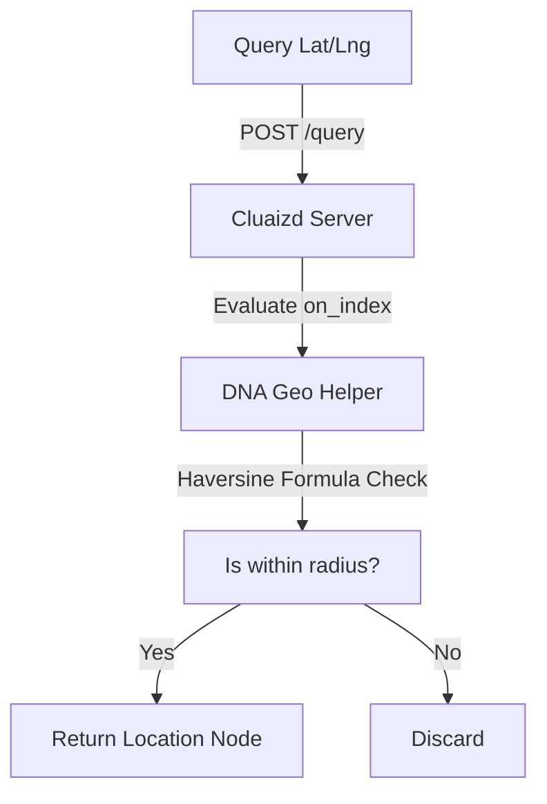

# 🌍 Mode 07: Geo-Spatial Database Paradigm (PostGIS-Style)

This guide details how to configure and run Cluaizd as a Geo-Spatial database, executing coordinates-based boundary calculations (Haversine formula) within Rhai DNA index scripts.

---

## 🏛️ Conceptual Mapping & Architecture

In Geo-Spatial Mode, neurons store geographical coordinates (latitude and longitude) inside their `vector_data` (e.g. index `0` as latitude and index `1` as longitude) or within their JSON payload. Radius and polygon distance containment checks are computed dynamically inside the DNA `on_index` hook.



---

## 🗄️ Server Configuration (`cluaizd.toml`)

Use the standard `dashmap` concurrency model for parallel read calculations:

```toml
[server]
host = "127.0.0.1"
port = 8080

[database]
concurrency_mode = "dashmap"
payload_format = "json"
```

---

## 🧬 The DNA Script (`genomes/geo_radius.rhai`)

To calculate distance between coordinates using the Haversine formula, attach this script to the neuron's `on_index` hook:

```rust
// genomes/geo_radius.rhai
// Haversine distance calculation in Rhai

let lat1 = vector_data[0]; // Node Latitude
let lon1 = vector_data[1]; // Node Longitude

let lat2 = config.query_lat;
let lon2 = config.query_lon;
let max_dist_km = config.max_distance_km;

// Simple distance approximation (or Haversine formula)
let dlat = (lat2 - lat1) * 111.0; // km per degree lat
let dlon = (lon2 - lon1) * 85.0;  // km per degree lon (approximate at mid-latitudes)

let distance_km = sqrt(dlat * dlat + dlon * dlon);

if distance_km <= max_dist_km {
    return #{
        "score": 1.0 / (1.0 + distance_km),
        "distance": distance_km
    };
}

return #{
    "score": 0.0
};
```

---

## 🐍 Client Implementation Examples

### Python Client (Adding Locations and Radius Querying)

```python
import requests
import json

BASE_URL = "http://127.0.0.1:8080"
HEADERS = {
    "x-tenant-id": "geo_sandbox",
    "Content-Type": "application/json"
}

def insert_location(name: str, lat: float, lon: float):
    # Store Lat/Lon in first two indexes of vector_data
    payload = {
        "raw_payload": json.dumps({"location_name": name}),
        "vector_data": [lat, lon] + [0.0] * 14,
        "model_creator_hash": "00" * 32,
        "payload_type": "text"
    }
    response = requests.post(f"{BASE_URL}/neuron", headers=HEADERS, json=payload)
    return response.json()

# Usage
insert_location("Central Park", 40.785091, -73.968285)
```

---

## 📈 Business & Research Applications

- **Ride-Sharing Applications:** Pinpointing vehicle locations matching a passenger's pickup radius.
- **Geofencing systems:** Triggering alert notifications when drones/autonomous objects traverse dynamic coordinates.
