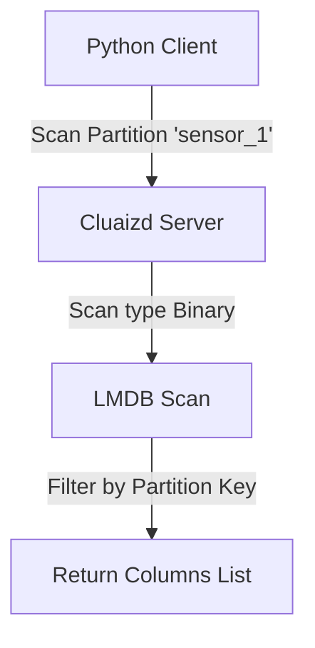

# 🏛️ Mode 08: Wide-Column Store Paradigm (Cassandra-Style)

This guide details how to configure and run Cluaizd as a Wide-Column Store, utilizing key partitioning and dynamic secondary index filtering.

---

## 🏛️ Conceptual Mapping & Architecture

In Wide-Column Mode, we group records using structured partition keys (e.g. `partition:row_key`). We utilize the prefix scanner `scan_neurons_by_type` or direct lookup hashes to slice out wide columns without loading unrelated datasets into memory.



---

## 🗄️ Server Configuration (`cluaizd.toml`)

Enable multi-threaded write scaling via `dashmap`:

```toml
[server]
host = "127.0.0.1"
port = 8080

[database]
concurrency_mode = "dashmap"
payload_format = "json"
```

---

## 🧬 The DNA Script (`genomes/wide_column.rhai`)

To enforce schema verification on specific column insertions dynamically:

```rust
// genomes/wide_column.rhai
// Wide-column write hook validation

let payload_str = payload;
let column_data = json(payload_str);

// Ensure column partition key exists
if column_data.partition_key == "" {
    return #{
        "action": "Abort",
        "error": "Missing wide-column partition_key value."
    };
}

return #{
    "action": "Allow"
};
```

---

## 🐍 Client Implementation Examples

### Python Client (Inserting and Scanning Partition Columns)

```python
import requests
import json

BASE_URL = "http://127.0.0.1:8080"
HEADERS = {
    "x-tenant-id": "widecolumn_sandbox",
    "Content-Type": "application/json"
}

def write_column(partition_key: str, column_name: str, value: str):
    column_payload = {
        "partition_key": partition_key,
        "column_name": column_name,
        "value": value
    }
    
    payload = {
        "raw_payload": json.dumps(column_payload),
        "vector_data": [0.0] * 16,
        "model_creator_hash": "00" * 32,
        "payload_type": "binary" # Stored under binary payload type for wide-column scans
    }
    response = requests.post(f"{BASE_URL}/neuron", headers=HEADERS, json=payload)
    return response.json()

# Usage
write_column("sensor_id_100", "temperature", "22.5")
write_column("sensor_id_100", "voltage", "12.0")
```

---

## 📈 Business & Research Applications

- **Telemetry Event Stores:** Storing high-frequency logs grouped by device ID partition namespaces.
- **User Profile Attributes:** Recording sparse attributes (e.g. preferences, settings) under user partitions.
