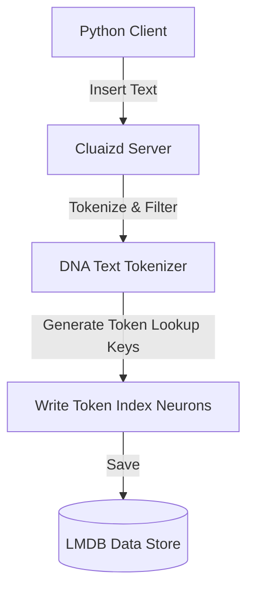

# 🔍 Mode 09: Full-Text Search Database Paradigm (Elasticsearch-Style)

This guide details how to configure and run Cluaizd as a Full-Text Search engine, indexing and tokenizing text strings within DNA write hooks.

---

## 🏛️ Conceptual Mapping & Architecture

In Full-Text Search Mode, the database acts as an inverted index. When a document is written, the DNA `on_write` or `on_index` hook splits the text into tokens (words), filters out stop words, and writes inverted index lookup neurons. Search queries match terms dynamically, ranking results based on term occurrence.



---

## 🗄️ Server Configuration (`cluaizd.toml`)

Set concurrency mode to `dashmap` to optimize concurrent index lookups:

```toml
[server]
host = "127.0.0.1"
port = 8080

[database]
concurrency_mode = "dashmap"
payload_format = "json"
```

---

## 🧬 The DNA Script (`genomes/full_text_indexer.rhai`)

To split payloads into tokens and prepare search terms dynamically on write:

```rust
// genomes/full_text_indexer.rhai
// Text tokenization write validator

let text = payload; // Raw text payload
let tokens = text.split(" "); // Split by whitespace

// Validation rule: ensure there are indexable terms
if tokens.len() == 0 {
    return #{
        "action": "Abort",
        "error": "Document contains no indexable terms."
    };
}

return #{
    "action": "Allow"
};
```

---

## 🐍 Client Implementation Examples

### Python Client (Indexing and Token Searching)

```python
import requests
import json
import uuid

BASE_URL = "http://127.0.0.1:8080"
HEADERS = {
    "x-tenant-id": "search_sandbox",
    "Content-Type": "application/json"
}

def index_document(doc_text: str):
    doc_id = str(uuid.uuid4())
    
    # Write primary document
    payload = {
        "raw_payload": doc_text,
        "vector_data": [0.0] * 16,
        "model_creator_hash": "00" * 32,
        "payload_type": "text"
    }
    requests.post(f"{BASE_URL}/neuron", headers=HEADERS, json=payload)
    
    # Tokenize and create inverted index lookups
    words = doc_text.lower().split()
    for word in set(words):
        # Deterministic token lookup neuron ID
        token_id = str(uuid.uuid5(uuid.NAMESPACE_DNS, f"token:{word}"))
        
        # Fetch existing index if any
        resp = requests.get(f"{BASE_URL}/neuron/{token_id}", headers=HEADERS)
        if resp.status_code == 200:
            index_data = json.loads(resp.json()["raw_payload"])
            index_data.append(doc_id)
        else:
            index_data = [doc_id]
            
        requests.post(f"{BASE_URL}/neuron", headers=HEADERS, json={
            "raw_payload": json.dumps(index_data),
            "vector_data": [0.0] * 16,
            "model_creator_hash": "00" * 32,
            "payload_type": "binary"
        })

# Usage
index_document("Cluaizd is a nervous system database")
```

---

## 📈 Business & Research Applications

- **E-Commerce Search Bars:** Querying product matches with token-level indexes.
- **Log Investigation Systems:** Finding critical server error tags across millions of event logs.
