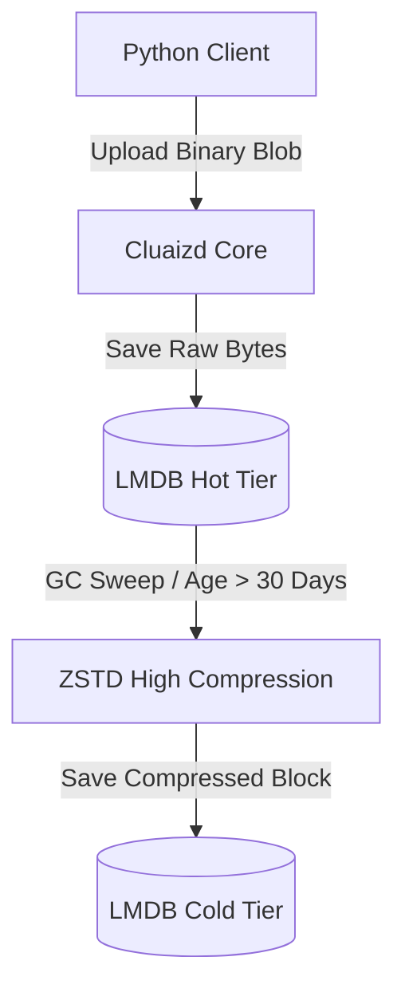

# 📦 Mode 10: Blob / Object Store Paradigm (AWS S3-Style)

This guide details how to configure and run Cluaizd as a Blob / Object Store, optimizing the storage matrix for heavy binary payloads using ZSTD compression and byte-level decay sweeps.

---

## 🏛️ Conceptual Mapping & Architecture

In Blob Mode, neurons act as binary buckets containing raw media, file streams, or backup archives inside their `raw_payload`. To prevent unbounded memory mapped growth, the DNA lifecycle hook compresses these blocks with high-density ZSTD when they enter the Cold State, keeping only reference tags in RAM.



---

## 🗄️ Server Configuration (`cluaizd.toml`)

Set default payload format to `flatbuffers` or `json` to allow fast zero-copy read scans:

```toml
[server]
host = "127.0.0.1"
port = 8080

[database]
concurrency_mode = "mutex"
payload_format = "json"
```

---

## 🧬 The DNA Script (`genomes/blob_lifecycle.rhai`)

To move binary files to ZSTD-compressed Cold storage as they age, attach this script to the lifecycle hook:

```rust
// genomes/blob_lifecycle.rhai
// Object store ZSTD compression lifecycle transition

let age_ns = neuron.age_ns;

// 30 Days in nanoseconds = 2,592,000,000,000,000 ns
if age_ns > 2592000000000000 {
    return #{
        "new_tier": "Cold",
        "action": "CompressZstd"
    };
}

return #{};
```

---

## 🐍 Client Implementation Examples

### Python Client (Uploading and Streaming Binary Objects)

```python
import requests
import json
import base64

BASE_URL = "http://127.0.0.1:8080"
HEADERS = {
    "x-tenant-id": "blob_sandbox",
    "Content-Type": "application/json"
}

def upload_blob(file_path: str, bucket_name: str):
    with open(file_path, "rb") as f:
        file_bytes = f.read()
        
    encoded_file = base64.b64encode(file_bytes).decode("utf-8")
    
    payload = {
        "raw_payload": encoded_file,
        "vector_data": [0.0] * 16,
        "model_creator_hash": "00" * 32,
        "payload_type": "binary",
        "dna": {
            "on_lifecycle": "let age_ns = neuron.age_ns; if age_ns > 2592000000000000 { return #{\"new_tier\": \"Cold\"}; } return #{};",
            "parameters": {"bucket": bucket_name},
            "engine": "rhai"
        }
    }
    response = requests.post(f"{BASE_URL}/neuron", headers=HEADERS, json=payload)
    return response.json()

# Usage
upload_blob("archive.zip", "backups")
```

---

## 📈 Business & Research Applications

- **Media Assets Hosting:** Storing static images, video files, or audio clips.
- **System Backups Archives:** Retaining historical snapshots compressed tightly at Tier 3.
