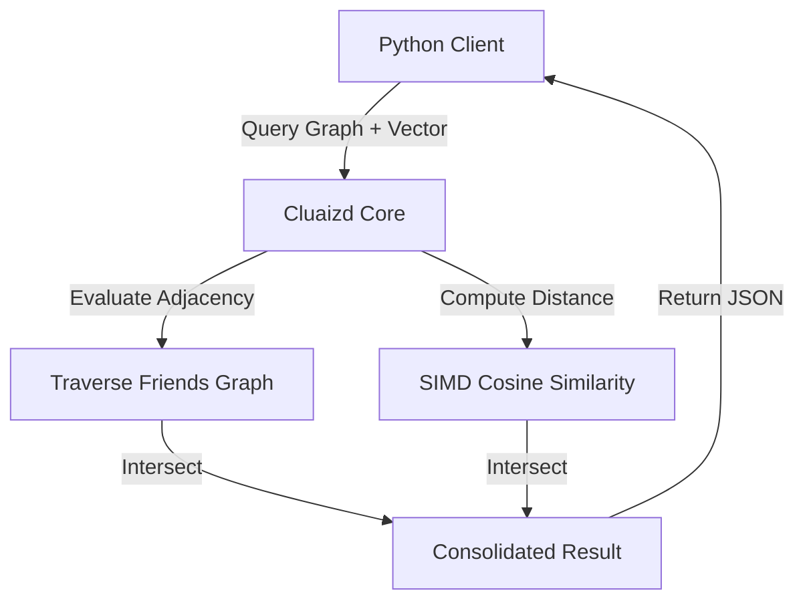

# 🧬 Mode 11: Multi-Model Database Paradigm (CosmosDB-Style)

This guide details how to configure and run Cluaizd as a Multi-Model Database, fusing document, graph, and vector capabilities within a unified process space.

---

## 🏛️ Conceptual Mapping & Architecture

In Multi-Model Mode, a single `UniversalNeuron` holds document properties (in `raw_payload`), network relationships (in `adjacency`), and semantic context (in `vector_data`). By combining these fields, developers query across document and graph databases without cross-system joins or multi-process synchronization.



---

## 🗄️ Server Configuration (`cluaizd.toml`)

Configure parallel query workers via `dashmap` to optimize complex multi-model processing:

```toml
[server]
host = "127.0.0.1"
port = 8080

[database]
concurrency_mode = "dashmap"
payload_format = "json"
```

---

## 🧬 The DNA Script (`genomes/multi_model.rhai`)

To handle complex validation (e.g. ensure user documents also contain valid vector hashes and connections):

```rust
// genomes/multi_model.rhai
// Multi-model schema write validator

let payload_str = payload;
let user_doc = json(payload_str);

// Ensure basic document attributes exist
if user_doc.username == "" {
    return #{
        "action": "Abort",
        "error": "Missing username in multi-model document record."
    };
}

return #{
    "action": "Allow"
};
```

---

## 🐍 Client Implementation Examples

### Python Client (Executing Multi-Model Queries)

```python
import requests
import json

BASE_URL = "http://127.0.0.1:8080"
HEADERS = {
    "x-tenant-id": "multimodel_sandbox",
    "Content-Type": "application/json"
}

def insert_profile(username: str, vector: list, friends: list):
    profile_payload = {
        "username": username,
        "type": "profile"
    }
    
    payload = {
        "raw_payload": json.dumps(profile_payload),
        "vector_data": vector,
        "model_creator_hash": "00" * 32,
        "payload_type": "text",
        "adjacency": [{"target_id": fid, "weight": 1.0} for fid in friends]
    }
    response = requests.post(f"{BASE_URL}/neuron", headers=HEADERS, json=payload)
    return response.json()

# Usage
# Profiles can have document properties, vector embeddings, and graph connections co-located!
```

---

## 📈 Business & Research Applications

- **AI-Powered Social Networks:** Recommending posts (vector search) from connected users (graph model) containing profile details (document model).
- **Comprehensive Entity Resolution:** Intersecting company graphs with text-based data logs.
