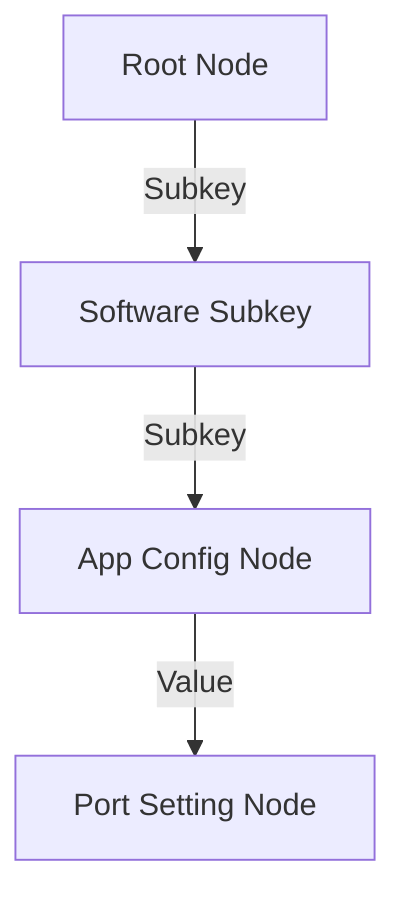

# 🌲 Mode 12: Hierarchical Database Paradigm (Windows Registry-Style)

This guide details how to configure and run Cluaizd as a Hierarchical Database, establishing parent-child 1:N tree layouts using neuron adjacencies and directional traversals.

---

## 🏛️ Conceptual Mapping & Architecture

In Hierarchical Mode, data elements (keys) are nested under parent nodes, creating a structural tree (such as `HKEY_LOCAL_MACHINE\Software\AppName`). Adjacency edges point exclusively from parent nodes down to child nodes. Traverse limits on queries ensure searches only cascade downward through branches.



---

## 🗄️ Server Configuration (`cluaizd.toml`)

Set concurrency model to `mutex` to prevent conflicting configuration writes across tree parent nodes:

```toml
[server]
host = "127.0.0.1"
port = 8080

[database]
concurrency_mode = "mutex"
payload_format = "json"
```

---

## 🧬 The DNA Script (`genomes/hierarchical_tree.rhai`)

To enforce strict parent-child routing constraints (e.g. restrict write actions unless they are linked to an active parent node):

```rust
// genomes/hierarchical_tree.rhai
// Hierarchical configuration validator

let payload_str = payload;
let key_data = json(payload_str);

// Parent key must exist
if key_data.parent_id == "" {
    return #{
        "action": "Abort",
        "error": "Hierarchical keys must register a valid parent_id connection."
    };
}

return #{
    "action": "Allow"
};
```

---

## 🐍 Client Implementation Examples

### Python Client (Creating Configuration Tree Nodes)

```python
import requests
import json

BASE_URL = "http://127.0.0.1:8080"
HEADERS = {
    "x-tenant-id": "registry_sandbox",
    "Content-Type": "application/json"
}

def create_registry_key(name: str, parent_id: str = None):
    key_payload = {
        "key_name": name,
        "parent_id": parent_id
    }
    
    adjacency = []
    if parent_id:
        # We represent hierarchical structures using graph edges from parent to child
        # Link child to parent
        pass
        
    payload = {
        "raw_payload": json.dumps(key_payload),
        "vector_data": [0.0] * 16,
        "model_creator_hash": "00" * 32,
        "payload_type": "text"
    }
    response = requests.post(f"{BASE_URL}/neuron", headers=HEADERS, json=payload)
    return response.json()["neuron_id"]

# Usage
root = create_registry_key("HKEY_LOCAL_MACHINE")
software = create_registry_key("Software", parent_id=root)
```

---

## 📈 Business & Research Applications

- **System Configurations registries:** Recording parameters nested inside parent-child settings keys.
- **Organizational Structure directories:** Mapping departments, teams, and member positions.
