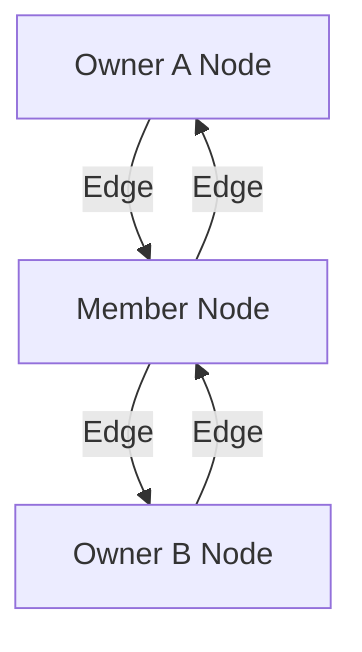

# 🕸️ Mode 13: Network Database Paradigm (IDMS-Style)

This guide details how to configure and run Cluaizd as a Network Database, establishing multi-owner relationships (M:N mappings) using flexible adjacency matrices and validation hooks.

---

## 🏛️ Conceptual Mapping & Architecture

In Network Mode, records (members) can be linked to multiple parent records (owners), bypassing the strict 1:N restrictions of hierarchical configurations. Relationships are represented as bidirectional weighted adjacencies inside the `UniversalNeuron`.



---

## 🗄️ Server Configuration (`cluaizd.toml`)

Enforce sequential database transitions using `mutex`:

```toml
[server]
host = "127.0.0.1"
port = 8080

[database]
concurrency_mode = "mutex"
payload_format = "json"
```

---

## 🧬 The DNA Script (`genomes/network_database.rhai`)

To validate that member nodes are correctly attached to at least one valid owner node on write:

```rust
// genomes/network_database.rhai
// Network owner connection validator

let payload_str = payload;
let member = json(payload_str);

// Check if member connects to multiple owners
if member.owners.len() == 0 {
    return #{
        "action": "Abort",
        "error": "Member record must register connection to at least one owner."
    };
}

return #{
    "action": "Allow"
};
```

---

## 🐍 Client Implementation Examples

### Python Client (Inserting Network Nodes & Owner Associations)

```python
import requests
import json

BASE_URL = "http://127.0.0.1:8080"
HEADERS = {
    "x-tenant-id": "network_sandbox",
    "Content-Type": "application/json"
}

def insert_member(name: str, owner_ids: list):
    member_payload = {
        "member_name": name,
        "owners": owner_ids
    }
    
    # Establish network links in adjacency list
    adjacency = [{"target_id": oid, "weight": 1.0} for oid in owner_ids]
    
    payload = {
        "raw_payload": json.dumps(member_payload),
        "vector_data": [0.0] * 16,
        "model_creator_hash": "00" * 32,
        "payload_type": "text",
        "adjacency": adjacency
    }
    response = requests.post(f"{BASE_URL}/neuron", headers=HEADERS, json=payload)
    return response.json()

# Usage
# Member record links back to multiple parent owners
```

---

## 📈 Business & Research Applications

- **Product Inventory Management:** Mapping parts suppliers (multiple suppliers per part and multiple parts per supplier).
- **Academic Citation Networks:** Connecting researchers, papers, and journals in complex citations structures.
