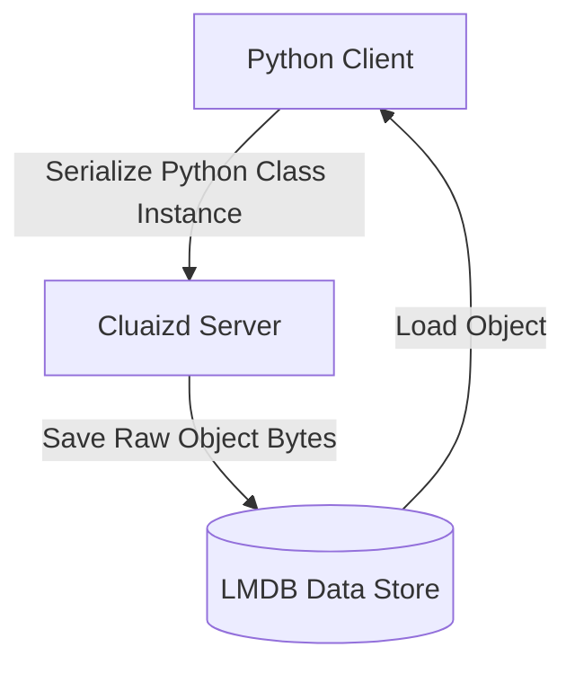

# 💎 Mode 14: Object-Oriented Database Paradigm (OODBMS / db4o-Style)

This guide details how to configure and run Cluaizd as an Object-Oriented Database, storing direct program classes and objects without mapping transformations.

---

## 🏛️ Conceptual Mapping & Architecture

In Object-Oriented Mode, programming objects (e.g. instance of a Python/C++ Class) are serialized directly into the neuron's `raw_payload`. There is no Object-Relational Mapping (ORM) translation layer. Fields, inheritance, and nested classes are preserved as binary blocks or JSON structures.



---

## 🗄️ Server Configuration (`cluaizd.toml`)

Enforce sequential execution boundaries via `mutex` to prevent conflicting class model writes:

```toml
[server]
host = "127.0.0.1"
port = 8080

[database]
concurrency_mode = "mutex"
payload_format = "json"
```

---

## 🧬 The DNA Script (`genomes/object_database.rhai`)

To validate that the class layout conforms to required schemas (e.g. check inheritance or mandatory fields):

```rust
// genomes/object_database.rhai
// Object structure validator

let payload_str = payload;
let obj = json(payload_str);

// Check if class namespace field exists
if obj._class == "" {
    return #{
        "action": "Abort",
        "error": "Object must register its programming class target namespace."
    };
}

return #{
    "action": "Allow"
};
```

---

## 🐍 Client Implementation Examples

### Python Client (Direct Class Instance Serialization)

```python
import requests
import json

BASE_URL = "http://127.0.0.1:8080"
HEADERS = {
    "x-tenant-id": "object_sandbox",
    "Content-Type": "application/json"
}

class UserProfile:
    def __init__(self, name: str, age: int):
        self.name = name
        self.age = age
        self._class = "UserProfile"

def save_object(obj):
    # Serialize the class object directly
    payload = {
        "raw_payload": json.dumps(obj.__dict__),
        "vector_data": [0.0] * 16,
        "model_creator_hash": "00" * 32,
        "payload_type": "text"
    }
    response = requests.post(f"{BASE_URL}/neuron", headers=HEADERS, json=payload)
    return response.json()

# Usage
user = UserProfile("Aryan", 25)
save_object(user)
```

---

## 📈 Business & Research Applications

- **Game Engine States:** Saving active scene objects, coordinate positions, and states directly from C++/C# classes without conversions.
- **Complex Engineering Models:** Storing nested CAD structures or network components.
