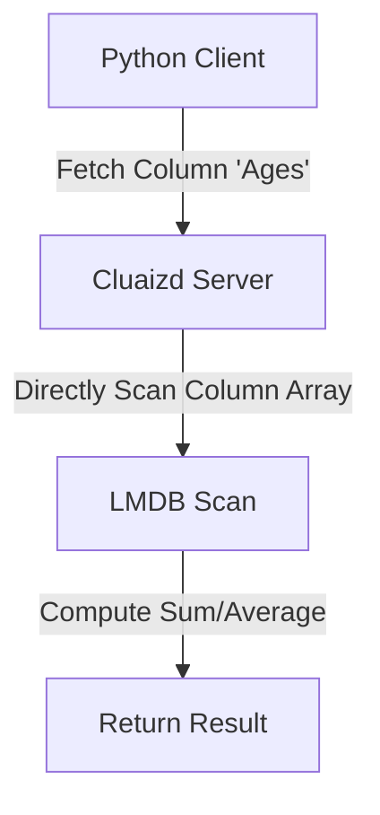

# 🧱 Mode 15: Columnar / Column-Oriented Database Paradigm (ClickHouse-Style)

This guide details how to configure and run Cluaizd as a Columnar Database, optimizing high-speed analytical queries (OLAP) and aggregations.

---

## 🏛️ Conceptual Mapping & Architecture

In Columnar Mode, instead of storing a complete row in a single neuron payload, each column data segment is stored under a distinct neuron or structured array index. Analytical queries read only the target columns (e.g. `ages` array) from disk, bypassing all other fields to achieve high-speed aggregation throughput.



---

## 🗄️ Server Configuration (`cluaizd.toml`)

Use parallel read scaling via `dashmap` to optimize analytical query runs:

```toml
[server]
host = "127.0.0.1"
port = 8080

[database]
concurrency_mode = "dashmap"
payload_format = "json"
```

---

## 🧬 The DNA Script (`genomes/columnar_validation.rhai`)

To validate columnar array sizes and data formats during write operations:

```rust
// genomes/columnar_validation.rhai
// Columnar block write validator

let payload_str = payload;
let column_block = json(payload_str);

// Ensure column has values
if column_block.values.len() == 0 {
    return #{
        "action": "Abort",
        "error": "Columnar data block must contain values."
    };
}

return #{
    "action": "Allow"
};
```

---

## 🐍 Client Implementation Examples

### Python Client (Inserting and Querying Columnar Blocks)

```python
import requests
import json

BASE_URL = "http://127.0.0.1:8080"
HEADERS = {
    "x-tenant-id": "columnar_sandbox",
    "Content-Type": "application/json"
}

def insert_column_block(column_name: str, values: list):
    # Store values of a single column as an array segment
    column_payload = {
        "column_name": column_name,
        "values": values
    }
    
    payload = {
        "raw_payload": json.dumps(column_payload),
        "vector_data": [0.0] * 16,
        "model_creator_hash": "00" * 32,
        "payload_type": "text"
    }
    response = requests.post(f"{BASE_URL}/neuron", headers=HEADERS, json=payload)
    return response.json()

# Usage
insert_column_block("age", [21, 25, 30, 42])
```

---

## 📈 Business & Research Applications

- **Heavy Analytics & BI Dashboarding:** Performing fast calculations (sums, averages) across millions of records.
- **Log Warehousing:** Storing server logs formatted into columns (timestamp, level, service) for rapid filtering.
