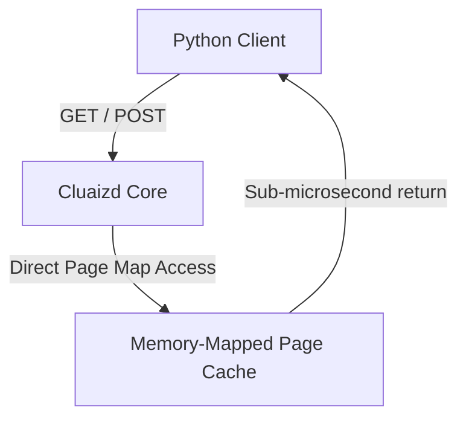

# ⚡ Mode 16: In-Memory Database Paradigm (IMDB / SAP HANA-Style)

This guide details how to configure and run Cluaizd as an In-Memory Database, optimizing access speeds using Hot State memory maps and zero-copy page management.

---

## 🏛️ Conceptual Mapping & Architecture

In In-Memory Mode, the entire active dataset resides in the memory-mapped space (`mmap`) of the database shard. By leveraging the LMDB core engine, read operations bypass standard disk latency and run at RAM speed.



---

## 🗄️ Server Configuration (`cluaizd.toml`)

Use the high-speed lock-free `dashmap` concurrency model for parallel read execution:

```toml
[server]
host = "127.0.0.1"
port = 8080

[database]
concurrency_mode = "dashmap"
payload_format = "json"
```

---

## 🧬 The DNA Script (`genomes/in_memory.rhai`)

To ensure that the dataset stays within memory boundaries (e.g. restrict lifecycle moves or compression):

```rust
// genomes/in_memory.rhai
// In-memory retention rules

// Always retain in Hot state (no transition to Cold)
return #{
    "new_tier": "Hot",
    "clear_payload": false
};
```

---

## 🐍 Client Implementation Examples

### Python Client (Direct RAM Memory Interaction)

```python
import requests
import json

BASE_URL = "http://127.0.0.1:8080"
HEADERS = {
    "x-tenant-id": "inmemory_sandbox",
    "Content-Type": "application/json"
}

def set_ram_data(key: str, val: str):
    payload = {
        "raw_payload": val,
        "vector_data": [0.0] * 16,
        "model_creator_hash": "00" * 32,
        "payload_type": "text",
        "dna": {
            "on_lifecycle": "return #{\"new_tier\": \"Hot\"};",
            "parameters": {},
            "engine": "rhai"
        }
    }
    # Writes go directly to memory-mapped files (RAM cache)
    response = requests.post(f"{BASE_URL}/neuron", headers=HEADERS, json=payload)
    return response.json()

# Usage
set_ram_data("active_user:1", "state_active")
```

---

## 📈 Business & Research Applications

- **Real-Time Bidding Systems:** Accessing bidder profiles with microsecond response times.
- **AI Inference Caching:** Storing hot weights or prompt templates for prompt token retrieval.
