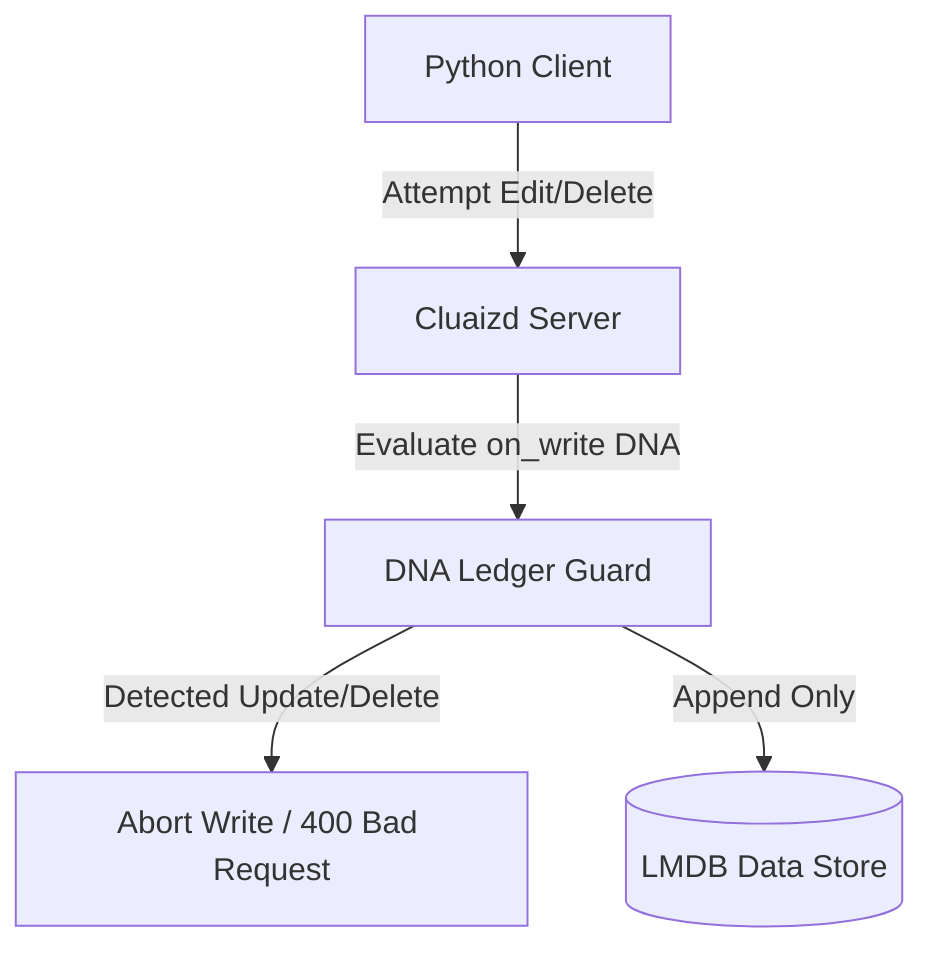

# 📜 Mode 17: Ledger / Blockchain Database Paradigm (Amazon QLDB-Style)

This guide details how to configure and run Cluaizd as a Ledger / Blockchain Database, enforcing immutable transaction blocks and cryptographically verifiable audit logs via DNA validation scripts.

---

## 🏛️ Conceptual Mapping & Architecture

In Ledger Mode, writes are strictly append-only. To prevent modifications (tumors) or deletions, the DNA `on_write` and `on_lifecycle` hooks immediately abort any `update` or `delete` requests. Each transaction contains a hash of the previous neuron record, building an unbroken cryptographic audit trail.



---

## 🗄️ Server Configuration (`cluaizd.toml`)

Set concurrency mode to `mutex` to serialize writes and maintain cryptographic block integrity:

```toml
[server]
host = "127.0.0.1"
port = 8080

[database]
concurrency_mode = "mutex"
payload_format = "json"
```

---

## 🧬 The DNA Script (`genomes/ledger_guard.rhai`)

To enforce strict append-only constraints and reject updates or deletions, use this script:

```rust
// genomes/ledger_guard.rhai
// Immutable ledger write validator

let action = action; // Provided by update framework if mutation is attempted

// If any transaction update or deletion is detected, block it immediately
if action == "Update" || action == "Delete" {
    return #{
        "action": "Abort",
        "error": "Ledger records are immutable. Updates and Deletions are forbidden."
    };
}

return #{
    "action": "Allow",
    "sync_write": "strict" // Enforce physical sync to SSD
};
```

---

## 🐍 Client Implementation Examples

### Python Client (Appending Immutable Ledger Blocks)

```python
import requests
import json
import hashlib

BASE_URL = "http://127.0.0.1:8080"
HEADERS = {
    "x-tenant-id": "ledger_sandbox",
    "Content-Type": "application/json"
}

def append_ledger_entry(tx_details: dict, prev_block_hash: str):
    # Pack transaction with previous block hash for cryptographic integrity
    tx_details["prev_hash"] = prev_block_hash
    tx_json = json.dumps(tx_details)
    
    # Calculate current block hash
    current_hash = hashlib.sha256(tx_json.encode("utf-8")).hexdigest()
    tx_details["current_hash"] = current_hash
    
    payload = {
        "raw_payload": json.dumps(tx_details),
        "vector_data": [0.0] * 16,
        "model_creator_hash": "00" * 32,
        "payload_type": "text",
        "dna": {
            "on_write": "let action = config.action; if action == \"Update\" || action == \"Delete\" { return #{\"action\": \"Abort\", \"error\": \"Ledger is immutable\"}; } return #{\"action\": \"Allow\"};",
            "parameters": {"action": "Insert"},
            "engine": "rhai"
        }
    }
    response = requests.post(f"{BASE_URL}/neuron", headers=HEADERS, json=payload)
    return response.json(), current_hash

# Usage
prev_hash = "00000000000000000000000000000000"
res, current_hash = append_ledger_entry({"from": "Alice", "to": "Bob", "amount": 10}, prev_hash)
```

---

## 📈 Business & Research Applications

- **Financial Auditing Ledgers:** Recording system transactions that must be cryptographically immutable.
- **Supply Chain Tracking:** Documenting step-by-step custody records of physical assets.
