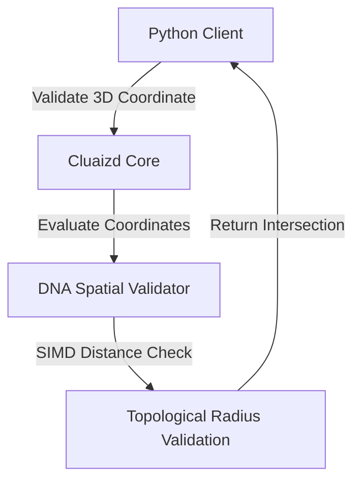

# 🌌 Mode 18: Spatial / Geographic Database Paradigm (Oracle Spatial-Style)

This guide details how to configure and run Cluaizd as a Spatial-Geographic Database, computing 3D topological dimensions and vector geometry bounds within DNA scripts.

---

## 🏛️ Conceptual Mapping & Architecture

Unlike simple Geo-Spatial checks that only calculate 2D flat coordinates, Spatial-Geographic Mode handles complex 3D geodetic geometries, elevation, and topological intersections. The coordinate space is stored directly inside the `vector_data` array, allowing SIMD hardware instructions to compute spatial intersections in nanoseconds.



---

## 🗄️ Server Configuration (`cluaizd.toml`)

Enable lock-free read scaling via `dashmap` for parallel distance queries:

```toml
[server]
host = "127.0.0.1"
port = 8080

[database]
concurrency_mode = "dashmap"
payload_format = "json"
```

---

## 🧬 The DNA Script (`genomes/spatial_topology.rhai`)

To calculate 3D Euclidean distances including elevation, use this script:

```rust
// genomes/spatial_topology.rhai
// 3D Spatial geometry validation in Rhai

let x1 = vector_data[0]; // Latitude
let y1 = vector_data[1]; // Longitude
let z1 = vector_data[2]; // Elevation/Z-axis

let x2 = config.query_x;
let y2 = config.query_y;
let z2 = config.query_z;
let threshold = config.max_distance;

// 3D Euclidean distance formula: sqrt((x2-x1)^2 + (y2-y1)^2 + (z2-z1)^2)
let dx = x2 - x1;
let dy = y2 - y1;
let dz = z2 - z1;

let distance = sqrt(dx * dx + dy * dy + dz * dz);

if distance <= threshold {
    return #{
        "score": 1.0 / (1.0 + distance),
        "distance": distance
    };
}

return #{
    "score": 0.0
};
```

---

## 🐍 Client Implementation Examples

### Python Client (Adding 3D Geometries & Querying)

```python
import requests
import json

BASE_URL = "http://127.0.0.1:8080"
HEADERS = {
    "x-tenant-id": "spatial_sandbox",
    "Content-Type": "application/json"
}

def insert_spatial_node(name: str, x: float, y: float, z: float):
    # Store 3D coordinates in first 3 vector slots
    payload = {
        "raw_payload": json.dumps({"name": name}),
        "vector_data": [x, y, z] + [0.0] * 13,
        "model_creator_hash": "00" * 32,
        "payload_type": "text"
    }
    response = requests.post(f"{BASE_URL}/neuron", headers=HEADERS, json=payload)
    return response.json()

# Usage
insert_spatial_node("Satellite A-100", 34.5, -118.2, 500.0) # Coordinates with elevation
```

---

## 📈 Business & Research Applications

- **Aviation & Satellite Tracking:** Monitoring aircraft coordinates, flight altitudes, and trajectories.
- **Meteorological 3D Models:** Storing weather radar pixel values with geographic coordinate bounds.
