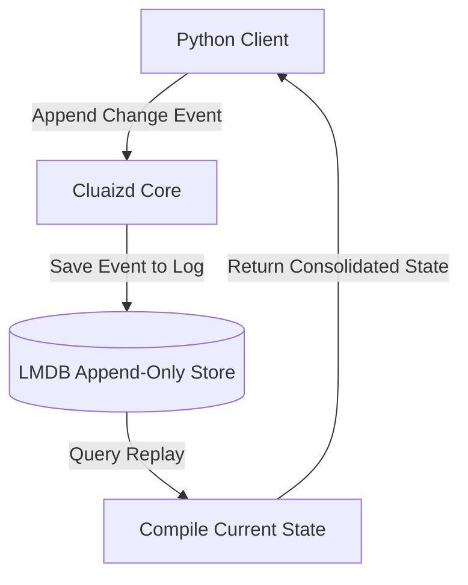

# 🔄 Mode 19: Event-Sourcing / Log-Structured Database Paradigm (Kafka-Style)

This guide details how to configure and run Cluaizd as an Event-Sourcing / Log-Structured Database, appending state transition events and compiling materialized logs via DNA hooks.

---

## 🏛️ Conceptual Mapping & Architecture

In Event-Sourcing Mode, we do not store the static final state of a record. Instead, we append every single change (event) as an immutable neuron. A query reads the chronological log and aggregates the state at runtime (replay). The DNA `on_write` and `on_lifecycle` hooks verify that events are appended sequentially.



---

## 🗄️ Server Configuration (`cluaizd.toml`)

Enable lock-free writing via `dashmap` to optimize high-throughput event logging:

```toml
[server]
host = "127.0.0.1"
port = 8080

[database]
concurrency_mode = "dashmap"
payload_format = "json"
```

---

## 🧬 The DNA Script (`genomes/event_stream.rhai`)

To enforce sequential ordering on incoming events (e.g. check that the event sequence ID is incremented):

```rust
// genomes/event_stream.rhai
// Event sourcing sequence validator

let payload_str = payload;
let event = json(payload_str);

// Validate event sequence key
if event.sequence_id < 0 {
    return #{
        "action": "Abort",
        "error": "Event sequence ID must be a positive integer."
    };
}

return #{
    "action": "Allow"
};
```

---

## 🐍 Client Implementation Examples

### Python Client (Appending and Replaying State Events)

```python
import requests
import json
import time

BASE_URL = "http://127.0.0.1:8080"
HEADERS = {
    "x-tenant-id": "eventsourcing_sandbox",
    "Content-Type": "application/json"
}

def append_event(aggregate_id: str, event_type: str, details: dict, sequence_id: int):
    event_payload = {
        "aggregate_id": aggregate_id,
        "event_type": event_type,
        "details": details,
        "sequence_id": sequence_id,
        "timestamp": int(time.time() * 1000)
    }
    
    payload = {
        "raw_payload": json.dumps(event_payload),
        "vector_data": [0.0] * 16,
        "model_creator_hash": "00" * 32,
        "payload_type": "text"
    }
    response = requests.post(f"{BASE_URL}/neuron", headers=HEADERS, json=payload)
    return response.json()

# Usage
# Append events chronologically
append_event("order_100", "OrderCreated", {"price": 99.0}, 1)
append_event("order_100", "OrderPaid", {"payment_gateway": "Stripe"}, 2)
```

---

## 📈 Business & Research Applications

- **Order Transaction Flows:** Appending order transitions (Created, Paid, Shipped) for absolute auditing.
- **User Activity Audit Streams:** Recording clickstreams and event actions chronologically.
