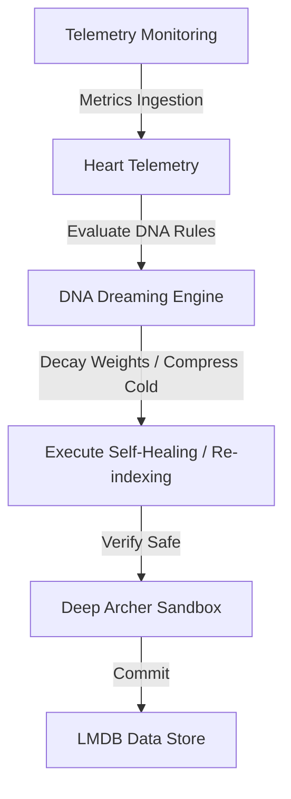

# 🤖 Mode 20: Autonomous Database Paradigm (Self-Driving / Oracle-Style)

This guide details how to configure and run Cluaizd as an Autonomous Database, enabling self-tuning, auto-indexing, and dynamic garbage collection adjustments via DNA lifecycle scripts.

---

## 🏛️ Conceptual Mapping & Architecture

In Autonomous Mode, the database evaluates its own resource metrics (e.g. storage utilization, read latency, memory footprint) using DNA scripts running under the background Dreaming Engine. The database dynamically self-heals by decaying dead edges, shifting cold data, or creating index parameters without manual DBA setup.



---

## 🗄️ Server Configuration (`cluaizd.toml`)

Enable multi-tenant automatic scaling and configure default telemetry polling:

```toml
[server]
host = "127.0.0.1"
port = 8080

[database]
concurrency_mode = "dashmap"
payload_format = "json"
```

---

## 🧬 The DNA Script (`genomes/autonomous_tune.rhai`)

To implement auto-tuning (e.g. compress payload and drop to Cold state if system memory/telemetry usage spikes), attach this script to the lifecycle hook:

```rust
// genomes/autonomous_tune.rhai
// Self-driving database resource tuning

let age_ns = neuron.age_ns;
let bp = system_metrics.bp; // Systolic BP metrics acting as CPU load proxy
let spo2 = system_metrics.spo2; // SPO2 metrics acting as disk health proxy

// If CPU load is extremely high and neuron is older than 1 day, compress to Cold state
if bp > 140 && age_ns > 86400000000000 {
    return #{
        "new_tier": "Cold",
        "action": "AutoOptimize"
    };
}

return #{};
```

---

## 🐍 Client Implementation Examples

### Python Client (Simulating Autonomous Operations)

```python
import requests
import json

BASE_URL = "http://127.0.0.1:8080"
HEADERS = {
    "x-tenant-id": "autonomous_sandbox",
    "Content-Type": "application/json"
}

def insert_self_managing_node(data: dict):
    payload = {
        "raw_payload": json.dumps(data),
        "vector_data": [0.0] * 16,
        "model_creator_hash": "00" * 32,
        "payload_type": "text",
        "dna": {
            "on_lifecycle": "let age_ns = neuron.age_ns; let bp = system_metrics.bp; if bp > 140 && age_ns > 86400000000000 { return #{\"new_tier\": \"Cold\"}; } return #{};",
            "parameters": {},
            "engine": "rhai"
        }
    }
    response = requests.post(f"{BASE_URL}/neuron", headers=HEADERS, json=payload)
    return response.json()

# Usage
insert_self_managing_node({"data_label": "temporary_session_log"})
```

---

## 📈 Business & Research Applications

- **Zero-Administration Edge Databases:** Deploying autonomous instances on remote cellular towers or robotic systems that must self-clean to prevent memory overflows.
- **Auto-Scale Web Backends:** Self-tuning query routing indexes based on current connection traffic.
