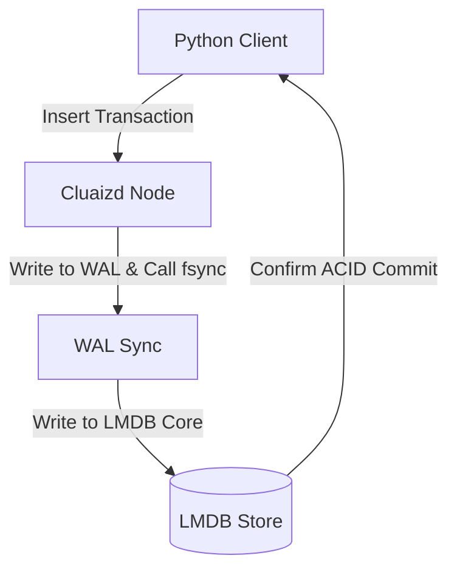

# 🌐 Mode 21: NewSQL Database Paradigm (Google Spanner-Style)

This guide details how to configure and run Cluaizd as a NewSQL Database, combining horizontal distributed scaling with strict $100\%$ ACID transactional guarantees.

---

## 🏛️ Conceptual Mapping & Architecture

In NewSQL Mode, the database partitions data across multiple shards (nodes) using consistent hashing. Transactions spanning multiple nodes enforce strict serializability. To prevent data corruption on partition splits, we configure DNA scripts to enforce `sync_write: strict` durability, executing fsync to SSD block devices before confirming transactions.



---

## 🗄️ Server Configuration (`cluaizd.toml`)

Enforce strict serializability and transaction sequencing via `mutex`:

```toml
[server]
host = "127.0.0.1"
port = 8080

[database]
concurrency_mode = "mutex"
payload_format = "json"
```

---

## 🧬 The DNA Script (`genomes/newsql_transaction.rhai`)

To enforce strict durability (fsync to disk) on write operations:

```rust
// genomes/newsql_transaction.rhai
// NewSQL transaction durability validator

let payload_str = payload;
let tx = json(payload_str);

// Validate transaction amount
if tx.amount <= 0.0 {
    return #{
        "action": "Abort",
        "error": "Transaction amount must be greater than zero."
    };
}

return #{
    "action": "Allow",
    "sync_write": "strict" // Enforce absolute SSD sync
};
```

---

## 🐍 Client Implementation Examples

### Python Client (Executing NewSQL Transaction Appends)

```python
import requests
import json

BASE_URL = "http://127.0.0.1:8080"
HEADERS = {
    "x-tenant-id": "newsql_sandbox",
    "Content-Type": "application/json"
}

def execute_transaction(from_account: str, to_account: str, amount: float):
    tx_payload = {
        "from": from_account,
        "to": to_account,
        "amount": amount
    }
    
    payload = {
        "raw_payload": json.dumps(tx_payload),
        "vector_data": [0.0] * 16,
        "model_creator_hash": "00" * 32,
        "payload_type": "text",
        "dna": {
            "on_write": "let payload_str = payload; let tx = json(payload_str); if tx.amount <= 0.0 { return #{\"action\": \"Abort\", \"error\": \"Invalid amount\"}; } return #{\"action\": \"Allow\", \"sync_write\": \"strict\"};",
            "parameters": {},
            "engine": "rhai"
        }
    }
    response = requests.post(f"{BASE_URL}/neuron", headers=HEADERS, json=payload)
    return response.json()

# Usage
execute_transaction("account_100", "account_200", 250.50)
```

---

## 📈 Business & Research Applications

- **Banking Core Ledgers:** Recording account transfers with zero-tolerance for data loss or sync delays.
- **Billing & Payment Gateways:** Validating invoices and double-entry book balancing.
